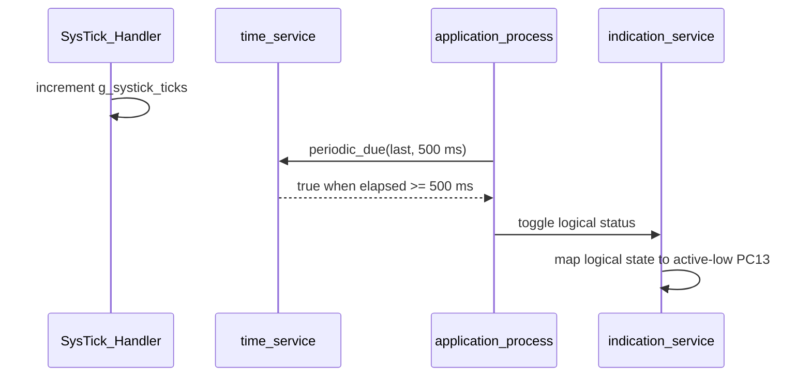

# 01 - Blink LED - GPIO Output and SysTick

> **Scope:** PC13 active-low output, RCC/GPIO configuration, a 1 kHz SysTick timebase, and non-blocking periodic application scheduling.

[Root](../../README.md) · [Examples](../README.md) · [Architecture](docs/architecture.md) · [Porting](docs/porting_guide.md)

## Table of contents

- [Purpose and expected behavior](#purpose-and-expected-behavior)
- [Hardware and wiring](#hardware-and-wiring)
- [Configuration](#configuration)
- [Runtime flow](#runtime-flow)
- [Register-level mechanism](#register-level-mechanism)
- [Initialization and failure propagation](#initialization-and-failure-propagation)
- [Concurrency and ownership](#concurrency-and-ownership)
- [Observability and debugging](#observability-and-debugging)
- [Design trade-offs and limitations](#design-trade-offs-and-limitations)
- [Build and run](#build-and-run)
- [References](#references)

## Purpose and expected behavior

This example is stage 01 of the repository's progressive register-level series. It keeps the same self-managed startup, linker, layer checker, RCC fallback policy, system composition root, and super-loop used by the other projects, then changes the peripheral/dataflow problem under study.

PC13 active-low output, RCC/GPIO configuration, a 1 kHz SysTick timebase, and non-blocking periodic application scheduling.

The important learning objective is not only “make the peripheral work.” The example is structured so that register knowledge remains concentrated in MCAL/platform code while Application expresses the observable behavior. Read the implementation from `system_init.c` downward and then compare the ownership discussion in [docs/architecture.md](docs/architecture.md).

## Hardware and wiring

```text
Blue Pill PC13 onboard LED

logical ON  -> PC13 driven LOW
logical OFF -> PC13 driven HIGH
```

The expected board is an STM32F103C8T6 Blue Pill using 3.3 V logic. ST-Link SWD uses PA13/PA14 plus ground/reference. Do not apply 5 V logic directly to a peripheral pin merely because a USB adapter or module is powered from 5 V; verify the actual interface circuitry.

## Configuration

| Setting | Value | Ownership |
|---|---:|---|
| `BOARD_HSE_FREQUENCY_HZ` | 8 MHz | board |
| `BOARD_TARGET_CLOCK_HZ` | 72 MHz | board |
| `BOARD_TIMEBASE_HZ` | 1000 Hz | board |
| `APPLICATION_BLINK_PERIOD_MS` | 500 ms | application |
| `SERVICE_EVENT_QUEUE_CAPACITY` | 16 | service scaffold |

Configuration is deliberately split by ownership:

- `config/board_config.h` describes board/peripheral timing and physical integration policy;
- `config/mcal_config.h` contains MCU-driver limits such as timeout counts, buffer sizes, or IRQ priority when appropriate;
- `config/service_config.h` contains service-level capacity/policy;
- `config/application_config.h` contains product/demo behavior.

Compile-time checks reject several invalid combinations before register programming begins. These guards are part of the example contract and should be updated together with a port, not bypassed casually.

## Runtime flow



The common boot path is still:

```text
Reset_Handler
    -> runtime_init()
        -> copy .data
        -> zero .bss
        -> main()
            -> IRQ disabled
            -> system_init()
            -> IRQ enabled only after success
            -> application_process() forever
```

Concrete examples use `cortex_m3_nop()` in `system_idle()` so the core remains running between super-loop iterations, which is convenient for the repository's expected ST-Link/debug setup.

## Register-level mechanism

### Timebase and scheduling

`mcal_systick_init()` accepts the **actual** core clock and requires an integer division by the requested tick frequency. It computes `LOAD = core_clock / tick_hz - 1`, rejects values outside SysTick's 24-bit reload range, then enables core-clock source, interrupt, and counter. The ISR does exactly one operation: increment `g_systick_ticks`.

`time_service_periodic_due()` compares unsigned elapsed time and, when due, sets `*last_run_ms = now_ms`. This gives wrap-safe elapsed arithmetic for periods shorter than the 32-bit wrap interval, but it is not a catch-up scheduler: if thread mode is delayed, the next phase is anchored to the late observation time. That is appropriate for a visual blink demo but should not be confused with phase-locked periodic execution.

### GPIO register path

The BSP declares PC13 as the status indication and marks it active-low. MCAL enables the GPIOC APB2 clock, rewrites the correct four-bit `CRH` field for pin 13, and uses `BSRR` for set/reset rather than a read-modify-write on `ODR`. The service deals only with logical ON/OFF/toggle.

### Event service is not in the active path

The system initializes a static event queue with capacity 16, but this example never pushes or pops an event. It is a scaffold for later event-driven work, not part of the LED timing mechanism. The documentation calls this out explicitly so the presence of the module is not mistaken for runtime use.

### Register ownership boundary

The device model under `platform/device/stm32f103xb/` contains only the register structs, memory addresses, bit masks, and IRQ identities required by the example. MCAL performs reads/writes on that model. BSP binds MCAL capabilities to Blue Pill resources. ECUAL, where present, implements external-device protocol. Services and Application do not include raw STM32 register headers.

This is a deliberate compromise between two bad extremes: hiding all registers behind a vendor framework, and scattering register writes throughout application code.

## Initialization and failure propagation

`system/system_init.c` is the composition root. Initialization is bottom-up: the board first establishes clocks/pins/peripherals, then services/ECUAL capabilities are initialized, then Application state is created. Any required lower-layer initialization returning false prevents the normal loop from starting.

Because `main()` disables interrupts before calling `system_init()`, an interrupt configured during board initialization does not execute until the entire initialization sequence succeeds and `main()` executes `cortex_m3_enable_irq()`. Code that needs a startup delay before that point must therefore use a mechanism independent of an interrupt tick unless it explicitly changes the contract.

Initialization failure is fail-closed: `main()` calls `system_panic()`, which disables interrupts and remains in a NOP loop. This is intentionally simple and debugger-visible; it is not a production recovery manager.

## Concurrency and ownership

Only SysTick modifies time asynchronously. Application reads the 32-bit tick counter in thread mode. On Cortex-M3 an aligned 32-bit load/store is a single architectural access; the project relies on that property for the simple monotonic tick. There is no queue between the SysTick ISR and Application and no GPIO work in the ISR.

For a deeper resource-by-resource ownership analysis, see [docs/architecture.md](docs/architecture.md).

## Observability and debugging

The project favors state that can be inspected directly in GDB without requiring a logging stack. Application-level `volatile` counters/status variables are used in examples where runtime observation is useful. The generated ELF also retains `-g3` debug information and the build emits a linker map and mixed source/disassembly listing.

Typical debug path:

```text
ST-Link / SWD
    |
OpenOCD :3333
    |
GDB
    |
reset halt -> load -> break main -> continue
```

When debugging a peripheral, inspect from the architecture boundary outward:

1. active system/bus clock;
2. GPIO mode and peripheral clock enable;
3. peripheral configuration registers;
4. status/error flags;
5. MCAL state/counters;
6. service/Application state.

This avoids treating an Application symptom as proof of an Application bug.

## Design trade-offs and limitations

- The blink scheduler re-anchors to `now_ms` after a late iteration; it does not execute missed periods.
- Concrete examples idle with `NOP`, so the CPU remains active between iterations.
- The event queue consumes static memory but is intentionally unused in this example.
- No watchdog or runtime clock-failure handling is implemented after initialization.

These limitations are intentional study boundaries rather than hidden production claims. The example should be extended only after its current ownership and timing contracts are understood.

## Build and run

From this example directory:

```bash
make check-layers
make
make size
make flash
```

Debug with:

```bash
make debug-server
# second terminal
make debug
```

The Makefile builds freestanding Cortex-M3 Thumb code, links with the project linker script and `libgcc`, and emits ELF/BIN/HEX/LST/map artifacts. `make` runs the layer checker before compilation.

## References

- [STMicroelectronics — STM32F1 Series Documentation](https://www.st.com/en/microcontrollers-microprocessors/stm32f1-series/documentation.html)
- [STMicroelectronics — RM0008: STM32F101/102/103/105/107 Reference Manual](https://www.st.com/resource/en/reference_manual/cd00171190-stm32f101xx-stm32f102xx-stm32f103xx-stm32f105xx-and-stm32f107xx-advanced-armbased-32bit-mcus-stmicroelectronics.pdf)
- [STMicroelectronics — STM32F103C8 Product Page](https://www.st.com/en/microcontrollers-microprocessors/stm32f103c8.html)
- [Arm — Cortex-M3 Devices Generic User Guide](https://developer.arm.com/documentation/dui0552/latest/)
- [GNU Binutils — GNU linker documentation](https://sourceware.org/binutils/docs/ld/)
- [OpenOCD User's Guide](https://openocd.org/doc/html/)

---

[← Examples index](../README.md) · [↑ Examples](../README.md) · [Architecture](docs/architecture.md) · [Porting](docs/porting_guide.md) · [02 GPIO input interrupt →](../02-gpio-input-interrupt/README.md)
