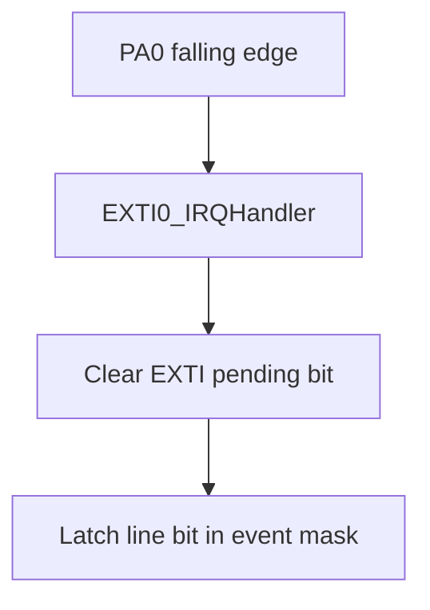
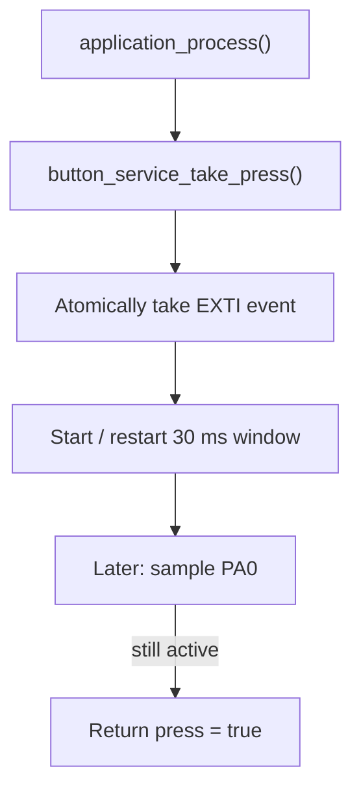

# 02 - GPIO Input Interrupt - EXTI and Debounce

> **Scope:** PA0 input with internal pull-up, AFIO/EXTI0 routing, NVIC priority, ISR event capture, and 30 ms thread-mode debounce.

[Root](../../README.md) · [Examples](../README.md) · [Architecture](docs/architecture.md) · [Porting](docs/porting_guide.md)

## Table of contents

- [Purpose and expected behavior](#purpose-and-expected-behavior)
- [Hardware and wiring](#hardware-and-wiring)
- [Configuration](#configuration)
- [Runtime flow](#runtime-flow)
- [Register-level mechanism](#register-level-mechanism)
- [Initialization and failure propagation](#initialization-and-failure-propagation)
- [Concurrency and ownership](#concurrency-and-ownership)
- [Observability and debugging](#observability-and-debugging)
- [Design trade-offs and limitations](#design-trade-offs-and-limitations)
- [Build and run](#build-and-run)
- [References](#references)

## Purpose and expected behavior

This example is stage 02 of the repository's progressive register-level series. It keeps the same self-managed startup, linker, layer checker, RCC fallback policy, system composition root, and super-loop used by the other projects, then changes the peripheral/dataflow problem under study.

PA0 input with internal pull-up, AFIO/EXTI0 routing, NVIC priority, ISR event capture, and 30 ms thread-mode debounce.

The important learning objective is not only “make the peripheral work.” The example is structured so that register knowledge remains concentrated in MCAL/platform code while Application expresses the observable behavior. Read the implementation from `system_init.c` downward and then compare the ownership discussion in [docs/architecture.md](docs/architecture.md).

## Hardware and wiring

```text
PA0 ---- push button ---- GND

released: internal pull-up -> HIGH
pressed: button -> LOW
EXTI trigger: falling edge
```

The expected board is an STM32F103C8T6 Blue Pill using 3.3 V logic. ST-Link SWD uses PA13/PA14 plus ground/reference. Do not apply 5 V logic directly to a peripheral pin merely because a USB adapter or module is powered from 5 V; verify the actual interface circuitry.

## Configuration

| Setting | Value |
|---|---:|
| HSE / target clock | 8 MHz / 72 MHz |
| timebase | 1 kHz |
| button | PA0, active-low, internal pull-up |
| EXTI line | 0 |
| EXTI trigger | falling edge |
| IRQ priority | 2 |
| debounce | 30 ms |
| event queue scaffold | 16 entries |

Configuration is deliberately split by ownership:

- `config/board_config.h` describes board/peripheral timing and physical integration policy;
- `config/mcal_config.h` contains MCU-driver limits such as timeout counts, buffer sizes, or IRQ priority when appropriate;
- `config/service_config.h` contains service-level capacity/policy;
- `config/application_config.h` contains product/demo behavior.

Compile-time checks reject several invalid combinations before register programming begins. These guards are part of the example contract and should be updated together with a port, not bypassed casually.

## Runtime flow

**Interrupt capture**



**Thread-mode qualification**



The common boot path is still:

```text
Reset_Handler
    -> runtime_init()
        -> copy .data
        -> zero .bss
        -> main()
            -> IRQ disabled
            -> system_init()
            -> IRQ enabled only after success
            -> application_process() forever
```

Concrete examples use `cortex_m3_nop()` in `system_idle()` so the core remains running between super-loop iterations, which is convenient for the repository's expected ST-Link/debug setup.

## Register-level mechanism

### EXTI configuration sequence

MCAL validates line, GPIO-port encoding, trigger mode, and a project priority range of 0..15. It enables AFIO, masks the line while configuring it, selects the GPIO port in `AFIO_EXTICR`, programs rising/falling trigger registers, clears stale pending state, programs the NVIC priority byte using the upper four priority bits, clears any pending NVIC request, enables the IRQ, then unmasks the EXTI line.

For line 0, the selected vector is `EXTI0_IRQn`. The board configuration uses priority 2.

### ISR-to-thread handoff

The ISR does not debounce. `record_pending_lines()` snapshots pending bits, clears the hardware pending register by writing the active bits, and ORs them into `g_exti_events`. Thread mode calls `mcal_exti_take_event()`, which saves PRIMASK, disables global interrupts, test-and-clears the requested event bit, then restores the prior interrupt-enable state. The critical section makes the event-bit take atomic relative to a new edge arriving in the ISR.

### Debounce semantics

The button service converts the raw edge into a delayed semantic press. A raw event marks debounce active and records the current time. Until 30 ms has elapsed, it returns no press. After the interval it samples the physical GPIO; only an active-low level is accepted. This filters contact bounce and also rejects a pulse that disappeared before the confirmation point. The service discards any stale event during initialization.

### Register ownership boundary

The device model under `platform/device/stm32f103xb/` contains only the register structs, memory addresses, bit masks, and IRQ identities required by the example. MCAL performs reads/writes on that model. BSP binds MCAL capabilities to Blue Pill resources. ECUAL, where present, implements external-device protocol. Services and Application do not include raw STM32 register headers.

This is a deliberate compromise between two bad extremes: hiding all registers behind a vendor framework, and scattering register writes throughout application code.

## Initialization and failure propagation

`system/system_init.c` is the composition root. Initialization is bottom-up: the board first establishes clocks/pins/peripherals, then services/ECUAL capabilities are initialized, then Application state is created. Any required lower-layer initialization returning false prevents the normal loop from starting.

Because `main()` disables interrupts before calling `system_init()`, an interrupt configured during board initialization does not execute until the entire initialization sequence succeeds and `main()` executes `cortex_m3_enable_irq()`. Code that needs a startup delay before that point must therefore use a mechanism independent of an interrupt tick unless it explicitly changes the contract.

Initialization failure is fail-closed: `main()` calls `system_panic()`, which disables interrupts and remains in a NOP loop. This is intentionally simple and debugger-visible; it is not a production recovery manager.

## Concurrency and ownership

There are two asynchronous producers of information: SysTick advances the timebase and EXTI0 records an edge. The debounce state itself belongs to thread mode. The only explicit IRQ critical section is the test-and-clear of the EXTI software event bit. The design therefore keeps ISR execution short and keeps the GPIO re-sampling/time policy out of interrupt context.

For a deeper resource-by-resource ownership analysis, see [docs/architecture.md](docs/architecture.md).

## Observability and debugging

The project favors state that can be inspected directly in GDB without requiring a logging stack. Application-level `volatile` counters/status variables are used in examples where runtime observation is useful. The generated ELF also retains `-g3` debug information and the build emits a linker map and mixed source/disassembly listing.

Typical debug path:

```text
ST-Link / SWD
    |
OpenOCD :3333
    |
GDB
    |
reset halt -> load -> break main -> continue
```

When debugging a peripheral, inspect from the architecture boundary outward:

1. active system/bus clock;
2. GPIO mode and peripheral clock enable;
3. peripheral configuration registers;
4. status/error flags;
5. MCAL state/counters;
6. service/Application state.

This avoids treating an Application symptom as proof of an Application bug.

## Design trade-offs and limitations

- This recognizes a debounced **press**, not a complete press/release gesture or long-press state machine.
- Falling-edge-only configuration means release bounce is irrelevant to the raw event path.
- The single software bit coalesces multiple EXTI edges before thread mode consumes it; edge count is not preserved.
- The generic event queue is initialized but not used by the current button path.

These limitations are intentional study boundaries rather than hidden production claims. The example should be extended only after its current ownership and timing contracts are understood.

## Build and run

From this example directory:

```bash
make check-layers
make
make size
make flash
```

Debug with:

```bash
make debug-server
# second terminal
make debug
```

The Makefile builds freestanding Cortex-M3 Thumb code, links with the project linker script and `libgcc`, and emits ELF/BIN/HEX/LST/map artifacts. `make` runs the layer checker before compilation.

## References

- [STMicroelectronics — STM32F1 Series Documentation](https://www.st.com/en/microcontrollers-microprocessors/stm32f1-series/documentation.html)
- [STMicroelectronics — RM0008: STM32F101/102/103/105/107 Reference Manual](https://www.st.com/resource/en/reference_manual/cd00171190-stm32f101xx-stm32f102xx-stm32f103xx-stm32f105xx-and-stm32f107xx-advanced-armbased-32bit-mcus-stmicroelectronics.pdf)
- [STMicroelectronics — STM32F103C8 Product Page](https://www.st.com/en/microcontrollers-microprocessors/stm32f103c8.html)
- [Arm — Cortex-M3 Devices Generic User Guide](https://developer.arm.com/documentation/dui0552/latest/)
- [GNU Binutils — GNU linker documentation](https://sourceware.org/binutils/docs/ld/)
- [OpenOCD User's Guide](https://openocd.org/doc/html/)

---

[← 01 Blink LED](../01-blink-led/README.md) · [↑ Examples](../README.md) · [Architecture](docs/architecture.md) · [Porting](docs/porting_guide.md) · [03 UART polling →](../03-uart-polling/README.md)
