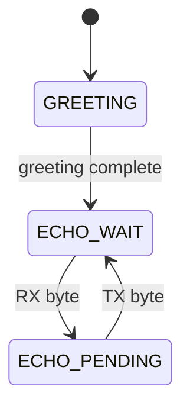

# 03 - UART Polling - USART1 Non-Blocking Byte I/O

> **Scope:** USART1 at 115200 8N1 using direct TXE/RXNE polling, BRR derived from the active APB2 clock, hardware-error capture, and a one-byte application echo state.

[Root](../../README.md) · [Examples](../README.md) · [Architecture](docs/architecture.md) · [Porting](docs/porting_guide.md)

## Table of contents

- [Purpose and expected behavior](#purpose-and-expected-behavior)
- [Hardware and wiring](#hardware-and-wiring)
- [Configuration](#configuration)
- [Runtime flow](#runtime-flow)
- [Register-level mechanism](#register-level-mechanism)
- [Initialization and failure propagation](#initialization-and-failure-propagation)
- [Concurrency and ownership](#concurrency-and-ownership)
- [Observability and debugging](#observability-and-debugging)
- [Design trade-offs and limitations](#design-trade-offs-and-limitations)
- [Build and run](#build-and-run)
- [References](#references)

## Purpose and expected behavior

This example is stage 03 of the repository's progressive register-level series. It keeps the same self-managed startup, linker, layer checker, RCC fallback policy, system composition root, and super-loop used by the other projects, then changes the peripheral/dataflow problem under study.

USART1 at 115200 8N1 using direct TXE/RXNE polling, BRR derived from the active APB2 clock, hardware-error capture, and a one-byte application echo state.

The important learning objective is not only “make the peripheral work.” The example is structured so that register knowledge remains concentrated in MCAL/platform code while Application expresses the observable behavior. Read the implementation from `system_init.c` downward and then compare the ownership discussion in [docs/architecture.md](docs/architecture.md).

## Hardware and wiring

```text
Blue Pill              USB-UART (3.3 V logic)
------------------------------------------------
PA9  / USART1_TX  ---> RX
PA10 / USART1_RX  <--- TX
GND                --- GND

terminal: 115200 8N1
```

The expected board is an STM32F103C8T6 Blue Pill using 3.3 V logic. ST-Link SWD uses PA13/PA14 plus ground/reference. Do not apply 5 V logic directly to a peripheral pin merely because a USB adapter or module is powered from 5 V; verify the actual interface circuitry.

## Configuration

| Setting | Value |
|---|---|
| HSE / target SYSCLK | 8 MHz / 72 MHz |
| USART | USART1 |
| pins | PA9 TX, PA10 RX |
| baud | 115200 |
| framing | 8 data bits, no parity, 1 stop bit |
| application greeting | `STM32F103 UART polling ready\r\n` |
| USART interrupts | none |

Configuration is deliberately split by ownership:

- `config/board_config.h` describes board/peripheral timing and physical integration policy;
- `config/mcal_config.h` contains MCU-driver limits such as timeout counts, buffer sizes, or IRQ priority when appropriate;
- `config/service_config.h` contains service-level capacity/policy;
- `config/application_config.h` contains product/demo behavior.

Compile-time checks reject several invalid combinations before register programming begins. These guards are part of the example contract and should be updated together with a port, not bypassed casually.

## Runtime flow



When TXE is not ready, `application_process()` returns without changing state. During `GREETING`, one byte is attempted per loop iteration; during `ECHO_PENDING`, the single pending byte is retried until accepted.

The common boot path is still:

```text
Reset_Handler
    -> runtime_init()
        -> copy .data
        -> zero .bss
        -> main()
            -> IRQ disabled
            -> system_init()
            -> IRQ enabled only after success
            -> application_process() forever
```

Concrete examples use `cortex_m3_nop()` in `system_idle()` so the core remains running between super-loop iterations, which is convenient for the repository's expected ST-Link/debug setup.

## Register-level mechanism

### USART clock and BRR

Board initialization configures PA9 as alternate-function push-pull and PA10 as floating input, enables USART1, and passes the active APB2 clock to MCAL. The BRR divisor is computed as `(pclk + baud/2) / baud`, i.e. rounded to the nearest integer representation used by this STM32F1 implementation, and is rejected if it falls outside the accepted `16..0xFFFF` range. This keeps 115200 viable both on the normal PLL clock and the HSI fallback without embedding a 72 MHz-only BRR constant.

### Receive path

The non-blocking read first samples `SR`. If parity/framing/noise/overrun flags or RXNE are present, it reads `DR`, which is part of the STM32F1 flag-clearing sequence. If an error was present, the byte is discarded and portable error bits are latched for the service/application to take later. If RXNE is set without an error, the data byte is returned.

### Transmit path

The non-blocking write tests TXE and writes DR only when the holding register can accept a byte. It does not wait for TC because the API contract is “byte accepted by USART transmit path,” not “last stop bit finished on the wire.”

### Application state

Application streams the greeting incrementally. Once the greeting is queued to hardware, it reads one byte and stores it in `g_echo_byte`; `g_echo_pending` prevents the application from consuming another RX byte until that byte is accepted for TX. This is intentionally tiny state, not a software FIFO.

### Register ownership boundary

The device model under `platform/device/stm32f103xb/` contains only the register structs, memory addresses, bit masks, and IRQ identities required by the example. MCAL performs reads/writes on that model. BSP binds MCAL capabilities to Blue Pill resources. ECUAL, where present, implements external-device protocol. Services and Application do not include raw STM32 register headers.

This is a deliberate compromise between two bad extremes: hiding all registers behind a vendor framework, and scattering register writes throughout application code.

## Initialization and failure propagation

`system/system_init.c` is the composition root. Initialization is bottom-up: the board first establishes clocks/pins/peripherals, then services/ECUAL capabilities are initialized, then Application state is created. Any required lower-layer initialization returning false prevents the normal loop from starting.

Because `main()` disables interrupts before calling `system_init()`, an interrupt configured during board initialization does not execute until the entire initialization sequence succeeds and `main()` executes `cortex_m3_enable_irq()`. Code that needs a startup delay before that point must therefore use a mechanism independent of an interrupt tick unless it explicitly changes the contract.

Initialization failure is fail-closed: `main()` calls `system_panic()`, which disables interrupts and remains in a NOP loop. This is intentionally simple and debugger-visible; it is not a production recovery manager.

## Concurrency and ownership

USART work is entirely thread-mode polling. There is no USART1 IRQ, no RX/TX ring, and therefore no ISR/thread data race inside the serial path. SysTick is not part of this example. Hardware, however, continues receiving asynchronously; if thread mode does not read RXNE before another byte arrives, USART ORE can be raised and the driver reports/discards the errored receive.

For a deeper resource-by-resource ownership analysis, see [docs/architecture.md](docs/architecture.md).

## Observability and debugging

The project favors state that can be inspected directly in GDB without requiring a logging stack. Application-level `volatile` counters/status variables are used in examples where runtime observation is useful. The generated ELF also retains `-g3` debug information and the build emits a linker map and mixed source/disassembly listing.

Typical debug path:

```text
ST-Link / SWD
    |
OpenOCD :3333
    |
GDB
    |
reset halt -> load -> break main -> continue
```

When debugging a peripheral, inspect from the architecture boundary outward:

1. active system/bus clock;
2. GPIO mode and peripheral clock enable;
3. peripheral configuration registers;
4. status/error flags;
5. MCAL state/counters;
6. service/Application state.

This avoids treating an Application symptom as proof of an Application bug.

## Design trade-offs and limitations

- No RX software buffering: sustained input can overrun if the super-loop cannot service RXNE quickly enough.
- Application deliberately allows only one pending echo byte.
- Polling consumes CPU attention and scales poorly when more cooperative tasks are added.
- The debug counters are observability variables, not a persistent diagnostic subsystem.

These limitations are intentional study boundaries rather than hidden production claims. The example should be extended only after its current ownership and timing contracts are understood.

## Build and run

From this example directory:

```bash
make check-layers
make
make size
make flash
```

Debug with:

```bash
make debug-server
# second terminal
make debug
```

The Makefile builds freestanding Cortex-M3 Thumb code, links with the project linker script and `libgcc`, and emits ELF/BIN/HEX/LST/map artifacts. `make` runs the layer checker before compilation.

## References

- [STMicroelectronics — STM32F1 Series Documentation](https://www.st.com/en/microcontrollers-microprocessors/stm32f1-series/documentation.html)
- [STMicroelectronics — RM0008: STM32F101/102/103/105/107 Reference Manual](https://www.st.com/resource/en/reference_manual/cd00171190-stm32f101xx-stm32f102xx-stm32f103xx-stm32f105xx-and-stm32f107xx-advanced-armbased-32bit-mcus-stmicroelectronics.pdf)
- [STMicroelectronics — STM32F103C8 Product Page](https://www.st.com/en/microcontrollers-microprocessors/stm32f103c8.html)
- [Arm — Cortex-M3 Devices Generic User Guide](https://developer.arm.com/documentation/dui0552/latest/)
- [GNU Binutils — GNU linker documentation](https://sourceware.org/binutils/docs/ld/)
- [OpenOCD User's Guide](https://openocd.org/doc/html/)

---

[← 02 GPIO input interrupt](../02-gpio-input-interrupt/README.md) · [↑ Examples](../README.md) · [Architecture](docs/architecture.md) · [Porting](docs/porting_guide.md) · [04 UART interrupt ring buffer →](../04-uart-interrupt-ring-buffer/README.md)
