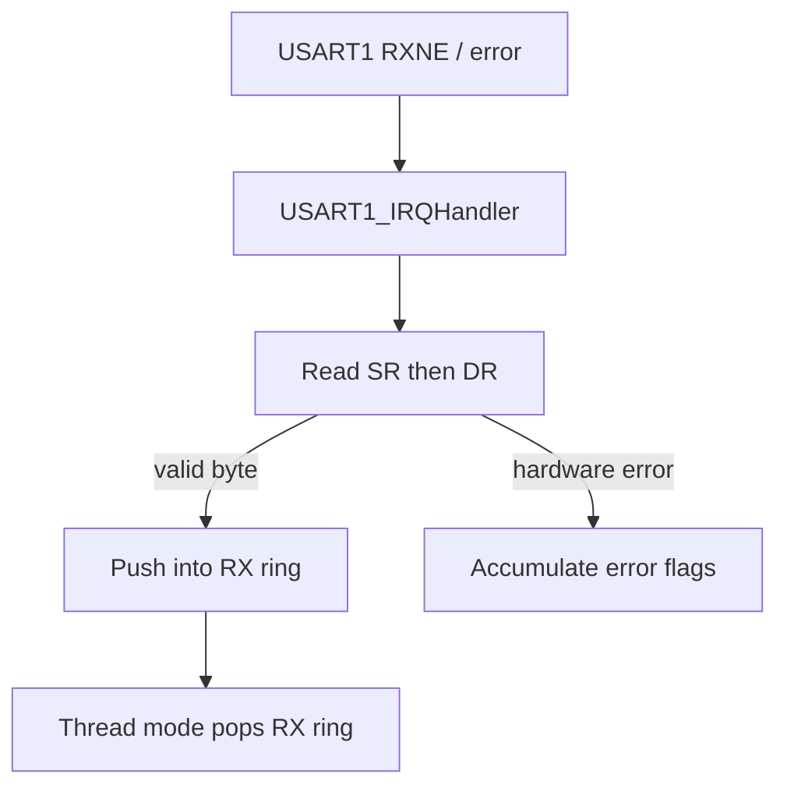
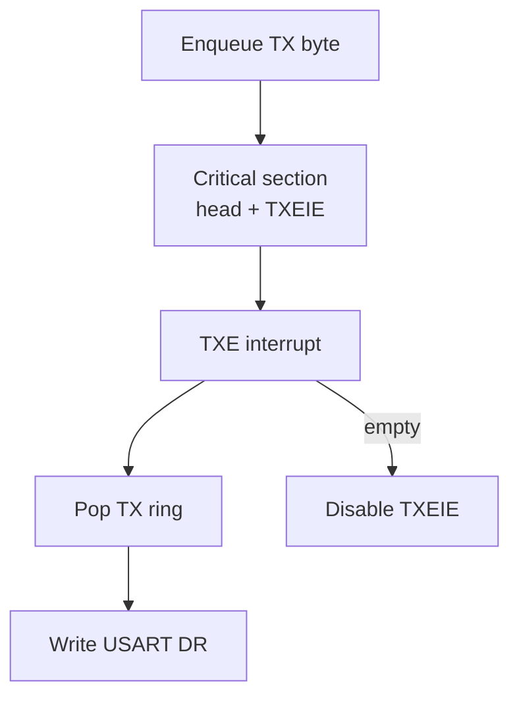

# 04 - UART Interrupt Ring Buffer - USART1 RX/TX SPSC Queues

> **Scope:** USART1 interrupt-driven RX/TX with two power-of-two static ring buffers, explicit ISR/thread producer-consumer ownership, overflow/error telemetry, and TXE interrupt gating.

[Root](../../README.md) · [Examples](../README.md) · [Architecture](docs/architecture.md) · [Porting](docs/porting_guide.md)

## Table of contents

- [Purpose and expected behavior](#purpose-and-expected-behavior)
- [Hardware and wiring](#hardware-and-wiring)
- [Configuration](#configuration)
- [Runtime flow](#runtime-flow)
- [Register-level mechanism](#register-level-mechanism)
- [Initialization and failure propagation](#initialization-and-failure-propagation)
- [Concurrency and ownership](#concurrency-and-ownership)
- [Observability and debugging](#observability-and-debugging)
- [Design trade-offs and limitations](#design-trade-offs-and-limitations)
- [Build and run](#build-and-run)
- [References](#references)

## Purpose and expected behavior

This example is stage 04 of the repository's progressive register-level series. It keeps the same self-managed startup, linker, layer checker, RCC fallback policy, system composition root, and super-loop used by the other projects, then changes the peripheral/dataflow problem under study.

USART1 interrupt-driven RX/TX with two power-of-two static ring buffers, explicit ISR/thread producer-consumer ownership, overflow/error telemetry, and TXE interrupt gating.

The important learning objective is not only “make the peripheral work.” The example is structured so that register knowledge remains concentrated in MCAL/platform code while Application expresses the observable behavior. Read the implementation from `system_init.c` downward and then compare the ownership discussion in [docs/architecture.md](docs/architecture.md).

## Hardware and wiring

```text
Blue Pill              USB-UART (3.3 V logic)
------------------------------------------------
PA9  / USART1_TX  ---> RX
PA10 / USART1_RX  <--- TX
GND                --- GND

terminal: 115200 8N1
```

The expected board is an STM32F103C8T6 Blue Pill using 3.3 V logic. ST-Link SWD uses PA13/PA14 plus ground/reference. Do not apply 5 V logic directly to a peripheral pin merely because a USB adapter or module is powered from 5 V; verify the actual interface circuitry.

## Configuration

| Setting | Value |
|---|---:|
| USART | USART1, PA9/PA10 |
| baud | 115200 |
| RX ring storage | 128 bytes |
| TX ring storage | 128 bytes |
| usable capacity | 127 bytes each |
| USART1 IRQ priority | 2 |
| greeting | `STM32F103 UART interrupt ring buffer ready\r\n` |

Configuration is deliberately split by ownership:

- `config/board_config.h` describes board/peripheral timing and physical integration policy;
- `config/mcal_config.h` contains MCU-driver limits such as timeout counts, buffer sizes, or IRQ priority when appropriate;
- `config/service_config.h` contains service-level capacity/policy;
- `config/application_config.h` contains product/demo behavior.

Compile-time checks reject several invalid combinations before register programming begins. These guards are part of the example contract and should be updated together with a port, not bypassed casually.

## Runtime flow

**Receive path**



**Transmit path**



The common boot path is still:

```text
Reset_Handler
    -> runtime_init()
        -> copy .data
        -> zero .bss
        -> main()
            -> IRQ disabled
            -> system_init()
            -> IRQ enabled only after success
            -> application_process() forever
```

Concrete examples use `cortex_m3_nop()` in `system_idle()` so the core remains running between super-loop iterations, which is convenient for the repository's expected ST-Link/debug setup.

## Register-level mechanism

### Ring representation

The MCAL uses static RX and TX arrays with 16-bit head/tail indices. Configuration requires each ring size to be a power of two, at least 2, and no larger than 32768. A one-slot-empty scheme distinguishes full from empty, therefore a configured size of 128 provides 127 bytes of usable payload capacity. Power-of-two sizing allows wrap through a mask rather than an expensive general modulo operation.

### RX ownership

The USART ISR is the only RX-head writer; thread mode is the only RX-tail writer. On RXNE, after the SR/DR error-clearing sequence, a valid byte is written at head if the next head would not collide with tail. On full, the newest hardware byte is dropped and an overflow counter increments; unread older bytes remain intact.

### TX ownership and the TXEIE race

Thread mode is the TX-head producer and ISR is the TX-tail consumer. A subtle race exists when the queue is empty: the ISR may conclude there is no work and clear TXEIE at the same moment thread mode enqueues a byte. If enqueue and interrupt enable were separate, a byte could remain stranded in the queue. `mcal_usart_try_write_byte()` therefore saves PRIMASK, disables interrupts, checks/updates the ring, enables TXEIE, then restores the previous PRIMASK state.

The ISR disables TXEIE again when there is no queued byte, preventing a permanent interrupt storm on the level-like TXE condition.

### Error and overflow accounting

Hardware PE/FE/NE/ORE flags are translated into portable error flags. Error/overflow take-and-clear operations use a short critical section because ISR updates and thread clearing must not race.

### Register ownership boundary

The device model under `platform/device/stm32f103xb/` contains only the register structs, memory addresses, bit masks, and IRQ identities required by the example. MCAL performs reads/writes on that model. BSP binds MCAL capabilities to Blue Pill resources. ECUAL, where present, implements external-device protocol. Services and Application do not include raw STM32 register headers.

This is a deliberate compromise between two bad extremes: hiding all registers behind a vendor framework, and scattering register writes throughout application code.

## Initialization and failure propagation

`system/system_init.c` is the composition root. Initialization is bottom-up: the board first establishes clocks/pins/peripherals, then services/ECUAL capabilities are initialized, then Application state is created. Any required lower-layer initialization returning false prevents the normal loop from starting.

Because `main()` disables interrupts before calling `system_init()`, an interrupt configured during board initialization does not execute until the entire initialization sequence succeeds and `main()` executes `cortex_m3_enable_irq()`. Code that needs a startup delay before that point must therefore use a mechanism independent of an interrupt tick unless it explicitly changes the contract.

Initialization failure is fail-closed: `main()` calls `system_panic()`, which disables interrupts and remains in a NOP loop. This is intentionally simple and debugger-visible; it is not a production recovery manager.

## Concurrency and ownership

This example is the repository's clearest SPSC demonstration. RX and TX deliberately split index ownership instead of placing a mutex around every ring operation. The implementation assumes the Cortex-M3 interrupt/thread execution model, aligned atomic index accesses, and volatile accesses to shared state. The short explicit critical sections are reserved for state that violates pure SPSC ownership: TXEIE enable coordination and take-and-clear counters.

For a deeper resource-by-resource ownership analysis, see [docs/architecture.md](docs/architecture.md).

## Observability and debugging

The project favors state that can be inspected directly in GDB without requiring a logging stack. Application-level `volatile` counters/status variables are used in examples where runtime observation is useful. The generated ELF also retains `-g3` debug information and the build emits a linker map and mixed source/disassembly listing.

Typical debug path:

```text
ST-Link / SWD
    |
OpenOCD :3333
    |
GDB
    |
reset halt -> load -> break main -> continue
```

When debugging a peripheral, inspect from the architecture boundary outward:

1. active system/bus clock;
2. GPIO mode and peripheral clock enable;
3. peripheral configuration registers;
4. status/error flags;
5. MCAL state/counters;
6. service/Application state.

This avoids treating an Application symptom as proof of an Application bug.

## Design trade-offs and limitations

- Full RX ring drops the newest byte and only records a count; no flow control is implemented.
- Rings are byte streams; there is no packet/message framing.
- One-slot-empty design sacrifices one entry to avoid a separate count/full flag.
- No DMA or hardware RTS/CTS is used.
- Application still retains a one-byte pending echo when TX ring is full, although RX can continue accumulating independently.

These limitations are intentional study boundaries rather than hidden production claims. The example should be extended only after its current ownership and timing contracts are understood.

## Build and run

From this example directory:

```bash
make check-layers
make
make size
make flash
```

Debug with:

```bash
make debug-server
# second terminal
make debug
```

The Makefile builds freestanding Cortex-M3 Thumb code, links with the project linker script and `libgcc`, and emits ELF/BIN/HEX/LST/map artifacts. `make` runs the layer checker before compilation.

## References

- [STMicroelectronics — STM32F1 Series Documentation](https://www.st.com/en/microcontrollers-microprocessors/stm32f1-series/documentation.html)
- [STMicroelectronics — RM0008: STM32F101/102/103/105/107 Reference Manual](https://www.st.com/resource/en/reference_manual/cd00171190-stm32f101xx-stm32f102xx-stm32f103xx-stm32f105xx-and-stm32f107xx-advanced-armbased-32bit-mcus-stmicroelectronics.pdf)
- [STMicroelectronics — STM32F103C8 Product Page](https://www.st.com/en/microcontrollers-microprocessors/stm32f103c8.html)
- [Arm — Cortex-M3 Devices Generic User Guide](https://developer.arm.com/documentation/dui0552/latest/)
- [GNU Binutils — GNU linker documentation](https://sourceware.org/binutils/docs/ld/)
- [OpenOCD User's Guide](https://openocd.org/doc/html/)

---

[← 03 UART polling](../03-uart-polling/README.md) · [↑ Examples](../README.md) · [Architecture](docs/architecture.md) · [Porting](docs/porting_guide.md) · [05 Timer PWM →](../05-timer-pwm/README.md)
