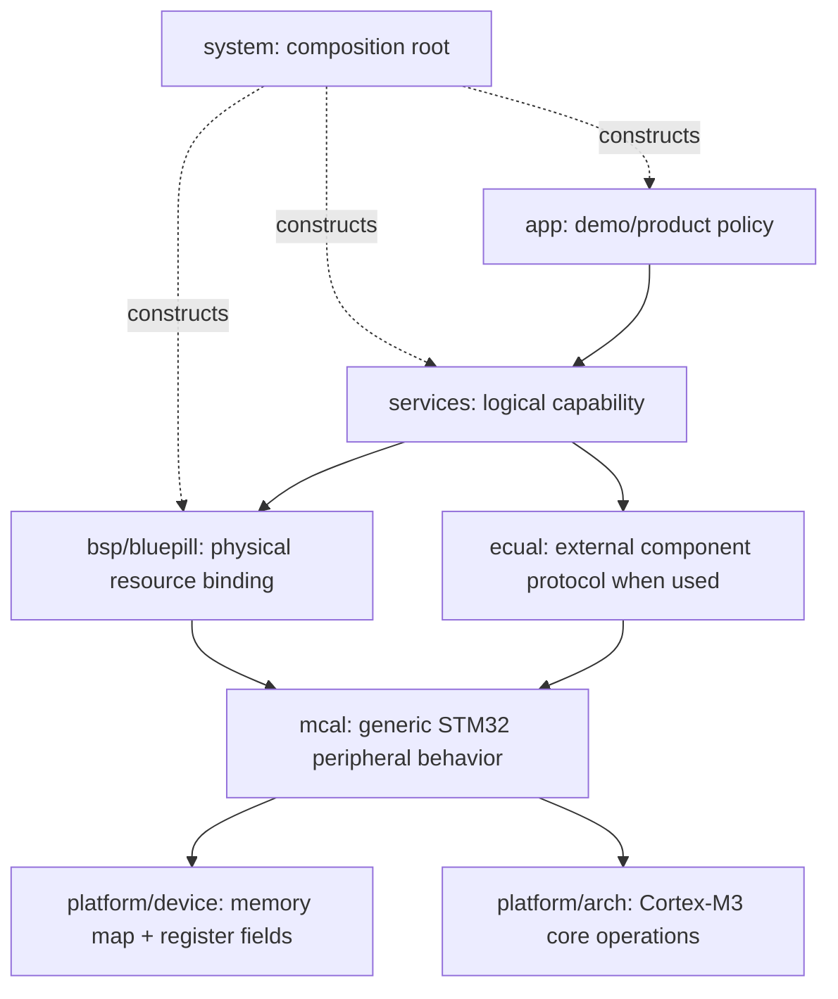
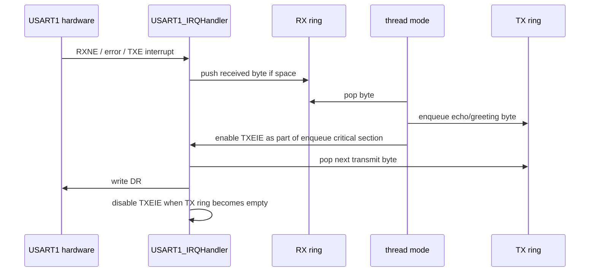

# 04 UART IRQ ring buffer - Architecture

> **Focus:** ownership, dependency direction, initialization ordering, execution contexts, data lifetime, and failure invariants for `04-uart-interrupt-ring-buffer`.

[← Example README](../README.md) · [Porting guide →](porting_guide.md) · [Examples index](../../README.md) · [Root](../../../README.md)

## Table of contents

- [Architectural slice](#architectural-slice)
- [Composition and initialization](#composition-and-initialization)
- [Source map and exact composition](#source-map-and-exact-composition)
- [Resource ownership](#resource-ownership)
- [Data and control flow](#data-and-control-flow)
- [Concurrency model](#concurrency-model)
- [Failure model](#failure-model)
- [Invariants](#invariants)
- [Why this structure matters](#why-this-structure-matters)
- [References](#references)

## Architectural slice

The example uses the repository's full dependency vocabulary even when some directories are intentionally thin:



`check_layers.py` mechanically checks local include direction. `system` is intentionally exempt from normal downward-only restrictions because it is the composition root that wires otherwise separated modules together.

The architecture is **procedural and statically composed**. There is no dependency-injection framework, heap, object registry, or RTOS task container. Dependencies are expressed through C calls and, for ECUAL transports, small function-pointer interfaces.

## Composition and initialization

The reset path establishes C runtime memory before any module initialization:

```text
vector table -> Reset_Handler -> runtime_init
                              -> .data copy
                              -> .bss clear
                              -> main
```

`main()` disables global interrupts, calls `system_init()`, enables them only on success, then repeatedly executes Application and idle. This provides a strong initialization boundary: no normal IRQ should observe partially initialized service/Application state.

For this example, the exact resource behavior is summarized in its [README](../README.md). The important architectural question is the order implied by `system_init.c`: lower-level board/peripheral invariants are established before a service exposes them, and service state exists before Application starts using it.

## Source map and exact composition

### Exact composition

```text
system_init
  -> board_init
       -> RCC HSE/PLL attempt or HSI fallback
       -> board_uart_init(active PCLK2)
            -> PA9/PA10
            -> USART1 + NVIC priority 2
            -> RXNE interrupt enabled
  -> serial_service_init
  -> application_init
```

The byte-stream path remains `Application -> serial_service -> board_uart -> mcal_usart`, but the MCAL now also owns `USART1_IRQHandler`, the RX/TX rings, error flags, overflow count, and TXEIE gating. The architecture therefore adds execution-context ownership without changing the Application-facing service shape.

## Resource ownership

A resource is considered owned by the lowest layer that must know its implementation detail:

| Concern | Owner | Reason |
|---|---|---|
| Application behavior/state | `app` | defines what the demo/product does |
| Logical capability/state | `services` | hides board/peripheral representation |
| Blue Pill pins and peripheral instance | `bsp/bluepill` | board-specific mapping |
| External IC command protocol | `ecual` when present | reusable independently of MCU bus instance |
| STM32 peripheral register sequence | `mcal` | MCU-specific but board-independent behavior |
| addresses/register structs/bit fields | `platform/device` | device register contract |
| PRIMASK/NVIC/SysTick/SCB/core ops | `platform/arch` | Cortex-M3 contract |
| startup wiring/composition/fault policy | `system` + `startup` | program construction/runtime boundary |

The key consequence is that Application can be read without RM0008 open beside it. RM0008 becomes necessary when reading MCAL/platform code, exactly where the register-level knowledge is supposed to live.

## Data and control flow



The diagram emphasizes behavior, but data ownership is equally important. State used only by one execution context stays private to that module. Shared ISR/thread state is either divided by producer/consumer ownership or protected with a short PRIMASK critical section. External-device payload buffers remain statically allocated and have an explicit owner during synchronous transactions.

## Concurrency model

This example is the repository's clearest SPSC demonstration. RX and TX deliberately split index ownership instead of placing a mutex around every ring operation. The implementation assumes the Cortex-M3 interrupt/thread execution model, aligned atomic index accesses, and volatile accesses to shared state. The short explicit critical sections are reserved for state that violates pure SPSC ownership: TXEIE enable coordination and take-and-clear counters.

The firmware is a single-core Cortex-M3 super-loop with interrupt preemption. There are no RTOS tasks, so “thread mode” here means the code running from `main()` outside exception handlers. Concurrency therefore comes from hardware peripherals, DMA, and interrupt exceptions rather than parallel CPU threads.

Critical sections save the existing PRIMASK state and restore it, rather than blindly enabling interrupts on exit. That matters because a helper can be called from a context where interrupts were already disabled.

## Failure model

The dominant initialization failure contract is boolean/status propagation upward:

```text
MCAL/BSP/ECUAL initialization failure
              |
              v
       system_init() == false
              |
              v
        system_panic()
```

Runtime failures that the example intentionally tolerates are represented in module/Application state rather than necessarily panicking. The README documents the exact distinction for this example. No exception handler attempts dynamic recovery; core faults converge on panic for deterministic debug behavior.

Timeouts are bounded loops rather than scheduler-based deadlines in lower-level startup-sensitive paths. This keeps initialization independent of interrupts, but a “poll count” should not be mistaken for a portable wall-clock duration.

## Invariants

1. RX ISR alone advances RX head; thread mode alone advances RX tail.
2. Thread mode alone advances TX head; ISR alone advances TX tail.
3. Enqueue and TXEIE enable are atomic relative to the USART ISR.
4. An empty TX ring implies TXEIE is eventually disabled.
5. RX overflow does not overwrite unread older data.
6. Error flags and overflow counters are observable without exposing USART registers above MCAL.

These invariants are more useful than memorizing call order. If a future change violates one, the design has changed and documentation/tests should be updated intentionally.

## Why this structure matters

A register-level project can easily become unmaintainable if every layer knows every bit field. This repository instead uses direct register access to make the hardware mechanism visible **and** a dependency boundary to keep that mechanism local.

That yields three practical learning benefits:

1. You can trace a high-level request down to the exact register writes.
2. You can change hardware binding without rewriting Application policy.
3. You can reason about ISR/shared-state ownership because there are few legal places where the same resource may be touched.

The cost is more source files and explicit interfaces than a single-file tutorial. That cost is deliberate: the project is practicing firmware architecture at the same time as register programming.

## References

- [STMicroelectronics — STM32F1 Series Documentation](https://www.st.com/en/microcontrollers-microprocessors/stm32f1-series/documentation.html)
- [STMicroelectronics — RM0008: STM32F101/102/103/105/107 Reference Manual](https://www.st.com/resource/en/reference_manual/cd00171190-stm32f101xx-stm32f102xx-stm32f103xx-stm32f105xx-and-stm32f107xx-advanced-armbased-32bit-mcus-stmicroelectronics.pdf)
- [STMicroelectronics — STM32F103C8 Product Page](https://www.st.com/en/microcontrollers-microprocessors/stm32f103c8.html)
- [Arm — Cortex-M3 Devices Generic User Guide](https://developer.arm.com/documentation/dui0552/latest/)
- [GNU Binutils — GNU linker documentation](https://sourceware.org/binutils/docs/ld/)
- [OpenOCD User's Guide](https://openocd.org/doc/html/)

---

[← Example README](../README.md) · [↑ Examples](../../README.md) · [Porting guide →](porting_guide.md)
