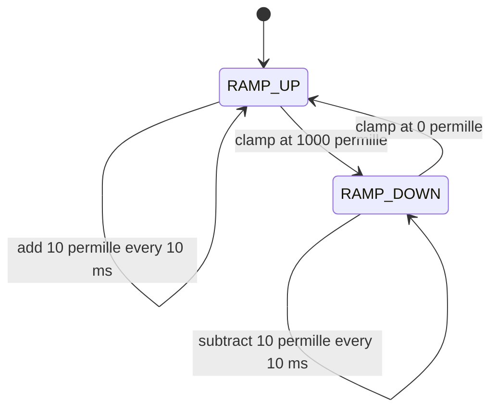

# 05 - Timer PWM - TIM2 Channel 1 Hardware Waveform

> **Scope:** TIM2 CH1 PWM mode 1 on PA0, exact clock-derived PSC/ARR configuration, preload behavior, permille duty conversion, and a scheduled 0-100% ramp.

[Root](../../README.md) · [Examples](../README.md) · [Architecture](docs/architecture.md) · [Porting](docs/porting_guide.md)

## Table of contents

- [Purpose and expected behavior](#purpose-and-expected-behavior)
- [Hardware and wiring](#hardware-and-wiring)
- [Configuration](#configuration)
- [Runtime flow](#runtime-flow)
- [Register-level mechanism](#register-level-mechanism)
- [Initialization and failure propagation](#initialization-and-failure-propagation)
- [Concurrency and ownership](#concurrency-and-ownership)
- [Observability and debugging](#observability-and-debugging)
- [Design trade-offs and limitations](#design-trade-offs-and-limitations)
- [Build and run](#build-and-run)
- [References](#references)

## Purpose and expected behavior

This example is stage 05 of the repository's progressive register-level series. It keeps the same self-managed startup, linker, layer checker, RCC fallback policy, system composition root, and super-loop used by the other projects, then changes the peripheral/dataflow problem under study.

TIM2 CH1 PWM mode 1 on PA0, exact clock-derived PSC/ARR configuration, preload behavior, permille duty conversion, and a scheduled 0-100% ramp.

The important learning objective is not only “make the peripheral work.” The example is structured so that register knowledge remains concentrated in MCAL/platform code while Application expresses the observable behavior. Read the implementation from `system_init.c` downward and then compare the ownership discussion in [docs/architecture.md](docs/architecture.md).

## Hardware and wiring

```text
PA0 / TIM2_CH1 ---- resistor/load/logic analyzer

Configured output: alternate-function push-pull, 50 MHz GPIO mode
PWM target: 1 kHz
```

The expected board is an STM32F103C8T6 Blue Pill using 3.3 V logic. ST-Link SWD uses PA13/PA14 plus ground/reference. Do not apply 5 V logic directly to a peripheral pin merely because a USB adapter or module is powered from 5 V; verify the actual interface circuitry.

## Configuration

| Setting | Value |
|---|---:|
| SYSCLK target | 72 MHz |
| APB1 | 36 MHz at normal clock |
| TIM2 input clock | 72 MHz at normal clock |
| timer tick | 1 MHz |
| PWM frequency | 1 kHz |
| update period | 10 ms |
| duty step | 10 permille = 1% |
| duty range | 0..1000 permille |

Configuration is deliberately split by ownership:

- `config/board_config.h` describes board/peripheral timing and physical integration policy;
- `config/mcal_config.h` contains MCU-driver limits such as timeout counts, buffer sizes, or IRQ priority when appropriate;
- `config/service_config.h` contains service-level capacity/policy;
- `config/application_config.h` contains product/demo behavior.

Compile-time checks reject several invalid combinations before register programming begins. These guards are part of the example contract and should be updated together with a port, not bypassed casually.

## Runtime flow



The common boot path is still:

```text
Reset_Handler
    -> runtime_init()
        -> copy .data
        -> zero .bss
        -> main()
            -> IRQ disabled
            -> system_init()
            -> IRQ enabled only after success
            -> application_process() forever
```

Concrete examples use `cortex_m3_nop()` in `system_idle()` so the core remains running between super-loop iterations, which is convenient for the repository's expected ST-Link/debug setup.

## Register-level mechanism

### Timer clock derivation

The board passes `mcal_rcc_get_apb1_timer_clock_hz()` rather than PCLK1 directly. At 72 MHz SYSCLK the code divides APB1 by two to respect the STM32F1 36 MHz APB1 limit; STM32F1 timers on a prescaled APB domain receive twice PCLK, yielding a 72 MHz TIM2 clock. Under 8 MHz HSI fallback APB1 is `/1`, so TIM2 receives 8 MHz.

### Exact PSC/ARR model

The PWM MCAL requires exact integer relationships between input clock, requested timer tick, and PWM frequency. At normal clock: `72 MHz / 1 MHz = 72`, so PSC is 71. `1 MHz / 1 kHz = 1000` counts, so ARR is 999. At HSI fallback PSC becomes 7 while ARR remains 999.

The driver configures PWM mode 1, enables CCR1 preload and ARR preload, enables channel 1 output, issues an update event to load shadow registers, then starts the counter.

### Duty representation

The service expresses duty in permille (`0..1000`). MCAL computes `CCR1 = (ARR + 1) * duty / 1000`. With ARR=999, CCR1=0 gives a true always-low PWM-mode-1 interval, while CCR1=1000 means CNT 0..999 is always less than CCR1, producing the 100% endpoint.

### CPU vs hardware work

The 10 ms Application schedule only changes CCR1. TIM2 creates every 1 kHz waveform edge in hardware; there is no TIM2 interrupt. SysTick is used only for the much slower duty-ramp policy.

### Register ownership boundary

The device model under `platform/device/stm32f103xb/` contains only the register structs, memory addresses, bit masks, and IRQ identities required by the example. MCAL performs reads/writes on that model. BSP binds MCAL capabilities to Blue Pill resources. ECUAL, where present, implements external-device protocol. Services and Application do not include raw STM32 register headers.

This is a deliberate compromise between two bad extremes: hiding all registers behind a vendor framework, and scattering register writes throughout application code.

## Initialization and failure propagation

`system/system_init.c` is the composition root. Initialization is bottom-up: the board first establishes clocks/pins/peripherals, then services/ECUAL capabilities are initialized, then Application state is created. Any required lower-layer initialization returning false prevents the normal loop from starting.

Because `main()` disables interrupts before calling `system_init()`, an interrupt configured during board initialization does not execute until the entire initialization sequence succeeds and `main()` executes `cortex_m3_enable_irq()`. Code that needs a startup delay before that point must therefore use a mechanism independent of an interrupt tick unless it explicitly changes the contract.

Initialization failure is fail-closed: `main()` calls `system_panic()`, which disables interrupts and remains in a NOP loop. This is intentionally simple and debugger-visible; it is not a production recovery manager.

## Concurrency and ownership

SysTick asynchronously advances the timebase, but the PWM timer itself does not share software state with an ISR. CCR1 is written from thread mode while preload is enabled, so the new compare value is transferred on an update event rather than arbitrarily changing the active comparison mid-period.

For a deeper resource-by-resource ownership analysis, see [docs/architecture.md](docs/architecture.md).

## Observability and debugging

The project favors state that can be inspected directly in GDB without requiring a logging stack. Application-level `volatile` counters/status variables are used in examples where runtime observation is useful. The generated ELF also retains `-g3` debug information and the build emits a linker map and mixed source/disassembly listing.

Typical debug path:

```text
ST-Link / SWD
    |
OpenOCD :3333
    |
GDB
    |
reset halt -> load -> break main -> continue
```

When debugging a peripheral, inspect from the architecture boundary outward:

1. active system/bus clock;
2. GPIO mode and peripheral clock enable;
3. peripheral configuration registers;
4. status/error flags;
5. MCAL state/counters;
6. service/Application state.

This avoids treating an Application symptom as proof of an Application bug.

## Design trade-offs and limitations

- Exact divisibility is required; the driver does not search for the closest PSC/ARR pair.
- The demo uses only TIM2 CH1 and edge-aligned up-counting PWM mode 1.
- No complementary outputs, dead time, center-aligned mode, capture, or timer IRQ are implemented.
- The 10 ms scheduler re-anchors to current time after a late loop iteration rather than catching up missed ramp steps.

These limitations are intentional study boundaries rather than hidden production claims. The example should be extended only after its current ownership and timing contracts are understood.

## Build and run

From this example directory:

```bash
make check-layers
make
make size
make flash
```

Debug with:

```bash
make debug-server
# second terminal
make debug
```

The Makefile builds freestanding Cortex-M3 Thumb code, links with the project linker script and `libgcc`, and emits ELF/BIN/HEX/LST/map artifacts. `make` runs the layer checker before compilation.

## References

- [STMicroelectronics — STM32F1 Series Documentation](https://www.st.com/en/microcontrollers-microprocessors/stm32f1-series/documentation.html)
- [STMicroelectronics — RM0008: STM32F101/102/103/105/107 Reference Manual](https://www.st.com/resource/en/reference_manual/cd00171190-stm32f101xx-stm32f102xx-stm32f103xx-stm32f105xx-and-stm32f107xx-advanced-armbased-32bit-mcus-stmicroelectronics.pdf)
- [STMicroelectronics — STM32F103C8 Product Page](https://www.st.com/en/microcontrollers-microprocessors/stm32f103c8.html)
- [Arm — Cortex-M3 Devices Generic User Guide](https://developer.arm.com/documentation/dui0552/latest/)
- [GNU Binutils — GNU linker documentation](https://sourceware.org/binutils/docs/ld/)
- [OpenOCD User's Guide](https://openocd.org/doc/html/)

---

[← 04 UART interrupt ring buffer](../04-uart-interrupt-ring-buffer/README.md) · [↑ Examples](../README.md) · [Architecture](docs/architecture.md) · [Porting](docs/porting_guide.md) · [06 I2C display →](../06-i2c-display/README.md)
