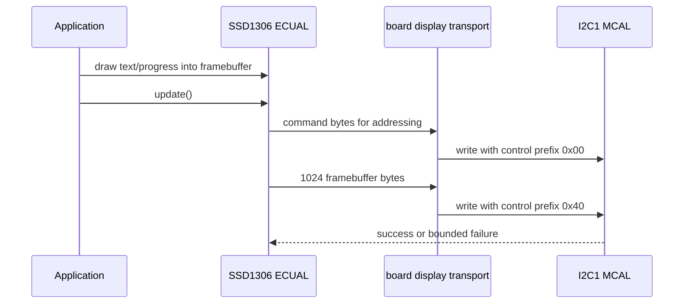

# 06 - I2C Display - SSD1306 Framebuffer over I2C1

> **Scope:** I2C1 bounded polling on PB6/PB7, active-clock timing calculation, SSD1306 transport composition, a 1024-byte framebuffer, and explicit display failure state.

[Root](../../README.md) · [Examples](../README.md) · [Architecture](docs/architecture.md) · [Porting](docs/porting_guide.md)

## Table of contents

- [Purpose and expected behavior](#purpose-and-expected-behavior)
- [Hardware and wiring](#hardware-and-wiring)
- [Configuration](#configuration)
- [Runtime flow](#runtime-flow)
- [Register-level mechanism](#register-level-mechanism)
- [Initialization and failure propagation](#initialization-and-failure-propagation)
- [Concurrency and ownership](#concurrency-and-ownership)
- [Observability and debugging](#observability-and-debugging)
- [Design trade-offs and limitations](#design-trade-offs-and-limitations)
- [Build and run](#build-and-run)
- [References](#references)

## Purpose and expected behavior

This example is stage 06 of the repository's progressive register-level series. It keeps the same self-managed startup, linker, layer checker, RCC fallback policy, system composition root, and super-loop used by the other projects, then changes the peripheral/dataflow problem under study.

I2C1 bounded polling on PB6/PB7, active-clock timing calculation, SSD1306 transport composition, a 1024-byte framebuffer, and explicit display failure state.

The important learning objective is not only “make the peripheral work.” The example is structured so that register knowledge remains concentrated in MCAL/platform code while Application expresses the observable behavior. Read the implementation from `system_init.c` downward and then compare the ownership discussion in [docs/architecture.md](docs/architecture.md).

## Hardware and wiring

```text
Blue Pill             SSD1306 128x64 I2C
------------------------------------------
3.3 V          ------ VCC
GND            ------ GND
PB6 / I2C1_SCL ------ SCL
PB7 / I2C1_SDA ------ SDA

Default 7-bit address: 0x3C
```

The expected board is an STM32F103C8T6 Blue Pill using 3.3 V logic. ST-Link SWD uses PA13/PA14 plus ground/reference. Do not apply 5 V logic directly to a peripheral pin merely because a USB adapter or module is powered from 5 V; verify the actual interface circuitry.

## Configuration

| Setting | Value |
|---|---:|
| I2C instance | I2C1 |
| SCL / SDA | PB6 / PB7, AF open-drain |
| requested bus clock | 400 kHz |
| SSD1306 address | 0x3C (7-bit) |
| display | 128x64 |
| framebuffer | 1024 bytes |
| power-on delay | 100 ms busy delay |
| I2C polling bound | 500000 loop iterations per wait |
| UI update period | 100 ms |
| progress step | 2% |

Configuration is deliberately split by ownership:

- `config/board_config.h` describes board/peripheral timing and physical integration policy;
- `config/mcal_config.h` contains MCU-driver limits such as timeout counts, buffer sizes, or IRQ priority when appropriate;
- `config/service_config.h` contains service-level capacity/policy;
- `config/application_config.h` contains product/demo behavior.

Compile-time checks reject several invalid combinations before register programming begins. These guards are part of the example contract and should be updated together with a port, not bypassed casually.

## Runtime flow



The common boot path is still:

```text
Reset_Handler
    -> runtime_init()
        -> copy .data
        -> zero .bss
        -> main()
            -> IRQ disabled
            -> system_init()
            -> IRQ enabled only after success
            -> application_process() forever
```

Concrete examples use `cortex_m3_nop()` in `system_idle()` so the core remains running between super-loop iterations, which is convenient for the repository's expected ST-Link/debug setup.

## Register-level mechanism

### I2C timing

MCAL validates PCLK1 in the STM32F1 I2C-supported range represented by the implementation and requires an integer MHz value for CR2 FREQ. For standard mode it computes CCR from `ceil(PCLK/(2*f))` and TRISE from `PCLK_MHz + 1`. For fast mode with duty=2 it uses `ceil(PCLK/(3*f))`, sets FS, and derives the 300 ns rise-time field.

At the normal 36 MHz PCLK1 and 400 kHz request, CCR=30 and TRISE=11, yielding 400 kHz by the chosen formula. Under 8 MHz HSI fallback, the first legal fast-mode divider is CCR=7, giving roughly 381 kHz rather than exceeding the requested ceiling.

### Bounded polling transaction

A write waits for bus-not-busy, generates START, waits SB, sends the address, waits ADDR, clears ADDR by the required SR1/SR2 reads, then transmits bytes using TXE and finally BTF before STOP. Bus/error/status waits are individually bounded by `MCAL_I2C_POLL_TIMEOUT_CYCLES`; the constant is not one wall-clock timeout for an entire 1024-byte frame. Failure paths request STOP and return false.

### ECUAL/BSP composition

The SSD1306 driver does not include I2C or STM32 headers. It receives a transport from the board layer: command writes use control byte `0x00`, display-data writes use `0x40`, and the board supplies the initialization delay. This keeps controller protocol separate from which MCU I2C peripheral carries it.

### Framebuffer and rendering

The framebuffer is `128 * (64/8) = 1024` bytes. Pixel storage is page-oriented: `index = x + (y/8)*128`, bit `y%8`. The compact renderer supports the glyph subset used by the demo (space, required punctuation, digits, uppercase A-Z), and progress-bar drawing modifies the same RAM image before a complete flush.

### Failure semantics

`application_init()` renders and flushes an initial frame; failure propagates out of `system_init()` and causes panic. A later runtime `display_service_present()` failure increments an error counter, marks the display non-operational, and prevents future update attempts. The current design chooses fail-stop for the display path rather than repeated bus recovery/retry.

### Register ownership boundary

The device model under `platform/device/stm32f103xb/` contains only the register structs, memory addresses, bit masks, and IRQ identities required by the example. MCAL performs reads/writes on that model. BSP binds MCAL capabilities to Blue Pill resources. ECUAL, where present, implements external-device protocol. Services and Application do not include raw STM32 register headers.

This is a deliberate compromise between two bad extremes: hiding all registers behind a vendor framework, and scattering register writes throughout application code.

## Initialization and failure propagation

`system/system_init.c` is the composition root. Initialization is bottom-up: the board first establishes clocks/pins/peripherals, then services/ECUAL capabilities are initialized, then Application state is created. Any required lower-layer initialization returning false prevents the normal loop from starting.

Because `main()` disables interrupts before calling `system_init()`, an interrupt configured during board initialization does not execute until the entire initialization sequence succeeds and `main()` executes `cortex_m3_enable_irq()`. Code that needs a startup delay before that point must therefore use a mechanism independent of an interrupt tick unless it explicitly changes the contract.

Initialization failure is fail-closed: `main()` calls `system_panic()`, which disables interrupts and remains in a NOP loop. This is intentionally simple and debugger-visible; it is not a production recovery manager.

## Concurrency and ownership

SysTick advances the application schedule. I2C transfers themselves execute synchronously in thread mode with bounded polling. During early initialization global IRQs are still disabled, so the 100 ms display power-on delay uses a CPU busy-loop rather than SysTick. The 1024-byte framebuffer is owned by the SSD1306 ECUAL and is not accessed from an ISR.

For a deeper resource-by-resource ownership analysis, see [docs/architecture.md](docs/architecture.md).

## Observability and debugging

The project favors state that can be inspected directly in GDB without requiring a logging stack. Application-level `volatile` counters/status variables are used in examples where runtime observation is useful. The generated ELF also retains `-g3` debug information and the build emits a linker map and mixed source/disassembly listing.

Typical debug path:

```text
ST-Link / SWD
    |
OpenOCD :3333
    |
GDB
    |
reset halt -> load -> break main -> continue
```

When debugging a peripheral, inspect from the architecture boundary outward:

1. active system/bus clock;
2. GPIO mode and peripheral clock enable;
3. peripheral configuration registers;
4. status/error flags;
5. MCAL state/counters;
6. service/Application state.

This avoids treating an Application symptom as proof of an Application bug.

## Design trade-offs and limitations

- Full-frame updates transfer 1024 data bytes plus command/control overhead every refresh.
- The driver has no dirty-region tracking or DMA.
- Runtime bus failure is terminal for display updates until reset; no I2C bus-unwedge sequence is implemented.
- Poll counts are CPU-loop bounds, not portable milliseconds.
- Framebuffer uses roughly 5% of the STM32F103C8's 20 KiB SRAM by itself.

These limitations are intentional study boundaries rather than hidden production claims. The example should be extended only after its current ownership and timing contracts are understood.

## Build and run

From this example directory:

```bash
make check-layers
make
make size
make flash
```

Debug with:

```bash
make debug-server
# second terminal
make debug
```

The Makefile builds freestanding Cortex-M3 Thumb code, links with the project linker script and `libgcc`, and emits ELF/BIN/HEX/LST/map artifacts. `make` runs the layer checker before compilation.

## References

- [STMicroelectronics — STM32F1 Series Documentation](https://www.st.com/en/microcontrollers-microprocessors/stm32f1-series/documentation.html)
- [STMicroelectronics — RM0008: STM32F101/102/103/105/107 Reference Manual](https://www.st.com/resource/en/reference_manual/cd00171190-stm32f101xx-stm32f102xx-stm32f103xx-stm32f105xx-and-stm32f107xx-advanced-armbased-32bit-mcus-stmicroelectronics.pdf)
- [STMicroelectronics — STM32F103C8 Product Page](https://www.st.com/en/microcontrollers-microprocessors/stm32f103c8.html)
- [Arm — Cortex-M3 Devices Generic User Guide](https://developer.arm.com/documentation/dui0552/latest/)
- [GNU Binutils — GNU linker documentation](https://sourceware.org/binutils/docs/ld/)
- [OpenOCD User's Guide](https://openocd.org/doc/html/)

---

[← 05 Timer PWM](../05-timer-pwm/README.md) · [↑ Examples](../README.md) · [Architecture](docs/architecture.md) · [Porting](docs/porting_guide.md) · [07 SPI memory →](../07-spi-memory/README.md)
