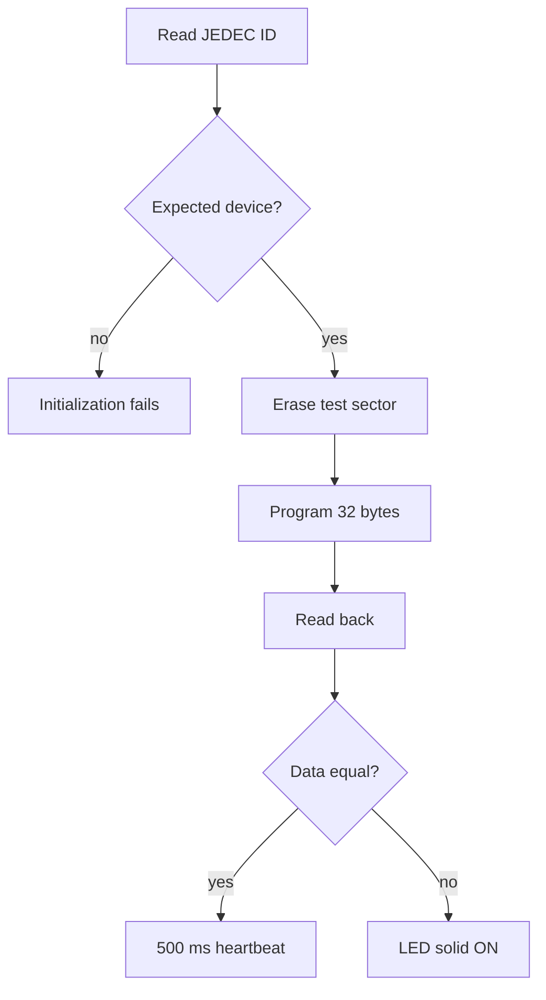

# 07 - SPI Memory - W25Q64 NOR Flash over SPI1

> **Scope:** SPI1 mode 0 with software chip select, bounded byte transfers, W25Q64 JEDEC/status protocol, destructive sector erase, page program, and read-back verification.

[Root](../../README.md) · [Examples](../README.md) · [Architecture](docs/architecture.md) · [Porting](docs/porting_guide.md)

## Table of contents

- [Purpose and expected behavior](#purpose-and-expected-behavior)
- [Hardware and wiring](#hardware-and-wiring)
- [Configuration](#configuration)
- [Runtime flow](#runtime-flow)
- [Register-level mechanism](#register-level-mechanism)
- [Initialization and failure propagation](#initialization-and-failure-propagation)
- [Concurrency and ownership](#concurrency-and-ownership)
- [Observability and debugging](#observability-and-debugging)
- [Design trade-offs and limitations](#design-trade-offs-and-limitations)
- [Build and run](#build-and-run)
- [References](#references)

## Purpose and expected behavior

This example is stage 07 of the repository's progressive register-level series. It keeps the same self-managed startup, linker, layer checker, RCC fallback policy, system composition root, and super-loop used by the other projects, then changes the peripheral/dataflow problem under study.

SPI1 mode 0 with software chip select, bounded byte transfers, W25Q64 JEDEC/status protocol, destructive sector erase, page program, and read-back verification.

The important learning objective is not only “make the peripheral work.” The example is structured so that register knowledge remains concentrated in MCAL/platform code while Application expresses the observable behavior. Read the implementation from `system_init.c` downward and then compare the ownership discussion in [docs/architecture.md](docs/architecture.md).

## Hardware and wiring

```text
STM32F103C8T6          W25Q64
--------------------------------
3.3 V          ------- VCC
GND            ------- GND
PA4            ------- CS
PA5 / SPI1_SCK ------- CLK
PA6 / MISO     <------ DO / D1
PA7 / MOSI     ------> DI / D0
```

The expected board is an STM32F103C8T6 Blue Pill using 3.3 V logic. ST-Link SWD uses PA13/PA14 plus ground/reference. Do not apply 5 V logic directly to a peripheral pin merely because a USB adapter or module is powered from 5 V; verify the actual interface circuitry.

## Configuration

| Setting | Value |
|---|---:|
| SPI | SPI1, mode 0, 8-bit, MSB first |
| CS | PA4 software-controlled |
| requested maximum SPI clock | 5 MHz |
| normal selected clock | 4.5 MHz (`72 MHz / 16`) |
| fallback selected clock | 4 MHz (`8 MHz / 2`) |
| flash geometry | 8 MiB, 256-byte pages, 4 KiB sectors |
| demo sector | `0x007FF000` |
| demo length | 32 bytes |
| power-on delay | 10 ms busy delay |

Configuration is deliberately split by ownership:

- `config/board_config.h` describes board/peripheral timing and physical integration policy;
- `config/mcal_config.h` contains MCU-driver limits such as timeout counts, buffer sizes, or IRQ priority when appropriate;
- `config/service_config.h` contains service-level capacity/policy;
- `config/application_config.h` contains product/demo behavior.

Compile-time checks reject several invalid combinations before register programming begins. These guards are part of the example contract and should be updated together with a port, not bypassed casually.

## Runtime flow



The expected JEDEC identity is manufacturer `0xEF` with capacity ID `0x17`, and the destructive test sector is `0x007FF000`. Runtime test failures increment `application_memory_error_count`.

The common boot path is still:

```text
Reset_Handler
    -> runtime_init()
        -> copy .data
        -> zero .bss
        -> main()
            -> IRQ disabled
            -> system_init()
            -> IRQ enabled only after success
            -> application_process() forever
```

Concrete examples use `cortex_m3_nop()` in `system_idle()` so the core remains running between super-loop iterations, which is convenient for the repository's expected ST-Link/debug setup.

## Register-level mechanism

### SPI clock selection

SPI1 is configured master, full duplex, 8-bit, MSB-first, CPOL=0, CPHA=0, software NSS (`SSM`/`SSI`). The MCAL checks the hardware divisors `/2..256` in increasing order and chooses the fastest divider whose rounded-up derived clock does not exceed `BOARD_MEMORY_SPI_MAX_HZ`. With 72 MHz PCLK2 and a 5 MHz ceiling it selects `/16` = 4.5 MHz; with 8 MHz fallback it selects `/2` = 4 MHz.

### Byte-transfer primitive

Each byte waits boundedly for TXE, writes DR, waits RXNE, and reads DR. Receive-only phases transmit dummy `0xFF`. After the final byte the driver waits until BSY clears before returning. Each status wait has its own `MCAL_SPI_POLL_TIMEOUT_CYCLES` bound.

### W25Q64 protocol

The ECUAL uses commands `0x9F` JEDEC ID, `0x05` Status Register-1, `0x06` Write Enable, `0x03` Read Data, `0x02` Page Program, and `0x20` 4 KiB Sector Erase. Initialization accepts manufacturer `0xEF` and capacity `0x17`; it records the middle memory-type byte for observability but does not require a particular value.

Before erase/program, the driver issues WREN and verifies the WEL bit. Internal program/erase completion is detected by polling BUSY with operation-specific finite poll limits. Those are iteration counts, not milliseconds, which keeps the path independent of SysTick while global interrupts are disabled.

`page_program()` rejects zero length, length >256, address overflow, or a request crossing a 256-byte page boundary. Sector erase aligns the supplied address down to a 4 KiB sector.

### Destructive self-test semantics

The Application stores a fixed 32-byte pattern ending in `0xA5`. Every reset erases the **last 4 KiB sector of the W25Q64**, programs the pattern at `0x007FF000`, reads it back, and records the first mismatch if verification fails. An operational erase/program/read/verify failure after successful memory-service initialization is represented by a solid status LED. By contrast, a JEDEC/init failure aborts `system_init()` and reaches `system_panic()` before that application failure indication can run.

### Register ownership boundary

The device model under `platform/device/stm32f103xb/` contains only the register structs, memory addresses, bit masks, and IRQ identities required by the example. MCAL performs reads/writes on that model. BSP binds MCAL capabilities to Blue Pill resources. ECUAL, where present, implements external-device protocol. Services and Application do not include raw STM32 register headers.

This is a deliberate compromise between two bad extremes: hiding all registers behind a vendor framework, and scattering register writes throughout application code.

## Initialization and failure propagation

`system/system_init.c` is the composition root. Initialization is bottom-up: the board first establishes clocks/pins/peripherals, then services/ECUAL capabilities are initialized, then Application state is created. Any required lower-layer initialization returning false prevents the normal loop from starting.

Because `main()` disables interrupts before calling `system_init()`, an interrupt configured during board initialization does not execute until the entire initialization sequence succeeds and `main()` executes `cortex_m3_enable_irq()`. Code that needs a startup delay before that point must therefore use a mechanism independent of an interrupt tick unless it explicitly changes the contract.

Initialization failure is fail-closed: `main()` calls `system_panic()`, which disables interrupts and remains in a NOP loop. This is intentionally simple and debugger-visible; it is not a production recovery manager.

## Concurrency and ownership

SPI and W25Q64 operations are synchronous thread-mode transactions; there is no SPI interrupt, DMA, or bus arbiter. SysTick is used only after initialization for the heartbeat. CS ownership is wholly inside the board transport during a transaction. Because the bus is single-client in this example, the design does not yet need a mutual-exclusion policy across multiple SPI devices.

For a deeper resource-by-resource ownership analysis, see [docs/architecture.md](docs/architecture.md).

## Observability and debugging

The project favors state that can be inspected directly in GDB without requiring a logging stack. Application-level `volatile` counters/status variables are used in examples where runtime observation is useful. The generated ELF also retains `-g3` debug information and the build emits a linker map and mixed source/disassembly listing.

Typical debug path:

```text
ST-Link / SWD
    |
OpenOCD :3333
    |
GDB
    |
reset halt -> load -> break main -> continue
```

When debugging a peripheral, inspect from the architecture boundary outward:

1. active system/bus clock;
2. GPIO mode and peripheral clock enable;
3. peripheral configuration registers;
4. status/error flags;
5. MCAL state/counters;
6. service/Application state.

This avoids treating an Application symptom as proof of an Application bug.

## Design trade-offs and limitations

- The demo is intentionally destructive to the final 4 KiB sector on every reset.
- Page program is single-page only; larger writes must be split by a higher layer.
- No wear leveling, filesystem, power-fail transaction scheme, or erase-count tracking is present.
- Busy/poll limits are iteration bounds and vary in wall time with CPU/build conditions.
- No SPI bus sharing/arbitration is implemented.
- Device identification checks manufacturer and capacity, not every possible W25Q64-compatible variant detail.

These limitations are intentional study boundaries rather than hidden production claims. The example should be extended only after its current ownership and timing contracts are understood.

## Build and run

From this example directory:

```bash
make check-layers
make
make size
make flash
```

Debug with:

```bash
make debug-server
# second terminal
make debug
```

The Makefile builds freestanding Cortex-M3 Thumb code, links with the project linker script and `libgcc`, and emits ELF/BIN/HEX/LST/map artifacts. `make` runs the layer checker before compilation.

## References

- [STMicroelectronics — STM32F1 Series Documentation](https://www.st.com/en/microcontrollers-microprocessors/stm32f1-series/documentation.html)
- [STMicroelectronics — RM0008: STM32F101/102/103/105/107 Reference Manual](https://www.st.com/resource/en/reference_manual/cd00171190-stm32f101xx-stm32f102xx-stm32f103xx-stm32f105xx-and-stm32f107xx-advanced-armbased-32bit-mcus-stmicroelectronics.pdf)
- [STMicroelectronics — STM32F103C8 Product Page](https://www.st.com/en/microcontrollers-microprocessors/stm32f103c8.html)
- [Arm — Cortex-M3 Devices Generic User Guide](https://developer.arm.com/documentation/dui0552/latest/)
- [GNU Binutils — GNU linker documentation](https://sourceware.org/binutils/docs/ld/)
- [OpenOCD User's Guide](https://openocd.org/doc/html/)

---

[← 06 I2C display](../06-i2c-display/README.md) · [↑ Examples](../README.md) · [Architecture](docs/architecture.md) · [Porting](docs/porting_guide.md) · [08 ADC DMA →](../08-adc-dma/README.md)
