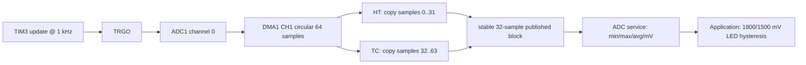

# 08 - ADC DMA - Timer-Triggered Sample Blocks

> **Scope:** TIM3 TRGO at 1 kHz, ADC1 channel 0 calibration and external triggering, DMA1 Channel 1 circular acquisition, stable half-buffer publication, measurement statistics, and LED hysteresis.

[Root](../../README.md) · [Examples](../README.md) · [Architecture](docs/architecture.md) · [Porting](docs/porting_guide.md)

## Table of contents

- [Purpose and expected behavior](#purpose-and-expected-behavior)
- [Hardware and wiring](#hardware-and-wiring)
- [Configuration](#configuration)
- [Runtime flow](#runtime-flow)
- [Register-level mechanism](#register-level-mechanism)
- [Initialization and failure propagation](#initialization-and-failure-propagation)
- [Concurrency and ownership](#concurrency-and-ownership)
- [Observability and debugging](#observability-and-debugging)
- [Design trade-offs and limitations](#design-trade-offs-and-limitations)
- [Build and run](#build-and-run)
- [References](#references)

## Purpose and expected behavior

This example is stage 08 of the repository's progressive register-level series. It keeps the same self-managed startup, linker, layer checker, RCC fallback policy, system composition root, and super-loop used by the other projects, then changes the peripheral/dataflow problem under study.

TIM3 TRGO at 1 kHz, ADC1 channel 0 calibration and external triggering, DMA1 Channel 1 circular acquisition, stable half-buffer publication, measurement statistics, and LED hysteresis.

The important learning objective is not only “make the peripheral work.” The example is structured so that register knowledge remains concentrated in MCAL/platform code while Application expresses the observable behavior. Read the implementation from `system_init.c` downward and then compare the ownership discussion in [docs/architecture.md](docs/architecture.md).

## Hardware and wiring

```text
3.3 V ---- potentiometer ---- GND
                 |
                 +---- PA0 / ADC1_IN0

PC13 onboard LED: threshold indication
```

The expected board is an STM32F103C8T6 Blue Pill using 3.3 V logic. ST-Link SWD uses PA13/PA14 plus ground/reference. Do not apply 5 V logic directly to a peripheral pin merely because a USB adapter or module is powered from 5 V; verify the actual interface circuitry.

## Configuration

| Setting | Value |
|---|---:|
| ADC input | ADC1 channel 0 / PA0 |
| reference used in calculation | 3300 mV |
| raw full scale | 4095 |
| maximum configured ADC clock | 12 MHz |
| sampling rate | 1000 samples/s |
| TIM3 timer tick | 1 MHz |
| DMA circular buffer | 64 x 16-bit samples |
| published block | 32 samples |
| DMA IRQ priority | 1 |
| LED ON/OFF thresholds | 1800 / 1500 mV |

Configuration is deliberately split by ownership:

- `config/board_config.h` describes board/peripheral timing and physical integration policy;
- `config/mcal_config.h` contains MCU-driver limits such as timeout counts, buffer sizes, or IRQ priority when appropriate;
- `config/service_config.h` contains service-level capacity/policy;
- `config/application_config.h` contains product/demo behavior.

Compile-time checks reject several invalid combinations before register programming begins. These guards are part of the example contract and should be updated together with a port, not bypassed casually.

## Runtime flow



The common boot path is still:

```text
Reset_Handler
    -> runtime_init()
        -> copy .data
        -> zero .bss
        -> main()
            -> IRQ disabled
            -> system_init()
            -> IRQ enabled only after success
            -> application_process() forever
```

Concrete examples use `cortex_m3_nop()` in `system_idle()` so the core remains running between super-loop iterations, which is convenient for the repository's expected ST-Link/debug setup.

## Register-level mechanism

### Hardware sampling chain

The acquisition rate is not generated by software delay or SysTick. TIM3 is configured so its update event becomes TRGO. At normal clock the APB1 timer input is 72 MHz; PSC=71 creates a 1 MHz timer tick and ARR=999 creates a 1 kHz update. At 8 MHz fallback PSC=7 preserves the same 1 MHz tick and 1 kHz trigger. No TIM3 ISR is used.

ADC1 channel 0 is configured for analog input and a 55.5-cycle sample time. The MCAL chooses the first ADC prescaler among `/2,/4,/6,/8` that keeps ADCCLK at or below the configured 12 MHz. At 72 MHz PCLK2 this is `/6` = 12 MHz; at 8 MHz it is `/2` = 4 MHz. Initialization resets ADC1, powers it, waits a conservative stabilization loop, performs reset calibration and calibration with bounded iteration waits, then enables DMA and TIM3-TRGO external trigger.

### DMA ownership

DMA1 Channel 1 writes 16-bit ADC DR values into a 64-sample static circular buffer with memory increment, high DMA priority, and half-transfer/transfer-complete/error interrupts. HT identifies samples 0..31 as completed; TC identifies samples 32..63.

The board ISR does not expose a pointer into the live DMA ring. It copies the completed 32-sample half into `g_completed_block` and marks it ready. If a previous block is still ready, `g_overrun_count` increments and the new copy replaces it. This is an explicit **latest-block-wins** policy: the system preserves freshness rather than guaranteeing lossless sample-block delivery.

Thread mode calls `board_adc_dma_take_sample_block()`. It saves PRIMASK, disables IRQ, checks ready state, copies the stable 32-sample block into service-owned storage, clears ready, and restores PRIMASK. The copy makes the ownership boundary simple, at the cost of a bounded 32-sample critical section.

### Service calculation

For each block the service computes min, max, a rounded integer average, and millivolts. The millivolt conversion is `((average * 3300) + 4095/2) / 4095`, so code-scale full scale maps to the configured 3300 mV reference. A sequence counter increments for each processed block. At 1000 samples/s and 32 samples/block, a block becomes available every 32 ms, or about 31.25 blocks/s if thread mode keeps up.

### Application hysteresis

PC13 turns on at or above 1800 mV and remains on until the measurement falls to or below 1500 mV. The 300 mV gap prevents chatter near one threshold. DMA overrun/error counters are also copied into volatile Application debug variables for inspection.

### Register ownership boundary

The device model under `platform/device/stm32f103xb/` contains only the register structs, memory addresses, bit masks, and IRQ identities required by the example. MCAL performs reads/writes on that model. BSP binds MCAL capabilities to Blue Pill resources. ECUAL, where present, implements external-device protocol. Services and Application do not include raw STM32 register headers.

This is a deliberate compromise between two bad extremes: hiding all registers behind a vendor framework, and scattering register writes throughout application code.

## Initialization and failure propagation

`system/system_init.c` is the composition root. Initialization is bottom-up: the board first establishes clocks/pins/peripherals, then services/ECUAL capabilities are initialized, then Application state is created. Any required lower-layer initialization returning false prevents the normal loop from starting.

Because `main()` disables interrupts before calling `system_init()`, an interrupt configured during board initialization does not execute until the entire initialization sequence succeeds and `main()` executes `cortex_m3_enable_irq()`. Code that needs a startup delay before that point must therefore use a mechanism independent of an interrupt tick unless it explicitly changes the contract.

Initialization failure is fail-closed: `main()` calls `system_panic()`, which disables interrupts and remains in a NOP loop. This is intentionally simple and debugger-visible; it is not a production recovery manager.

## Concurrency and ownership

This example has three execution agents: TIM3 generates trigger events in hardware, DMA writes memory autonomously, and the CPU alternates between DMA ISR and thread mode. Correctness depends on ownership of *which half is stable*. Copying a completed half in ISR prevents DMA from later rewriting the source while the service analyzes it. The design pays ISR-copy cost to avoid a more complex zero-copy buffer-state protocol.

For a deeper resource-by-resource ownership analysis, see [docs/architecture.md](docs/architecture.md).

## Observability and debugging

The project favors state that can be inspected directly in GDB without requiring a logging stack. Application-level `volatile` counters/status variables are used in examples where runtime observation is useful. The generated ELF also retains `-g3` debug information and the build emits a linker map and mixed source/disassembly listing.

Typical debug path:

```text
ST-Link / SWD
    |
OpenOCD :3333
    |
GDB
    |
reset halt -> load -> break main -> continue
```

When debugging a peripheral, inspect from the architecture boundary outward:

1. active system/bus clock;
2. GPIO mode and peripheral clock enable;
3. peripheral configuration registers;
4. status/error flags;
5. MCAL state/counters;
6. service/Application state.

This avoids treating an Application symptom as proof of an Application bug.

## Design trade-offs and limitations

- The latest-block-wins policy can drop entire 32-sample blocks under thread-mode overload.
- ISR copies 32 samples on every HT/TC event; this is simple but not minimal ISR work.
- Thread critical section copies another 32 samples, increasing interrupt latency for a bounded interval.
- `3300 mV` is a configured reference assumption, not a measured VDDA calibration.
- No analog filtering, calibration curve, oversampling, or timestamp per block is implemented.
- No SysTick is used; sampling cadence belongs to TIM3 hardware.

These limitations are intentional study boundaries rather than hidden production claims. The example should be extended only after its current ownership and timing contracts are understood.

## Build and run

From this example directory:

```bash
make check-layers
make
make size
make flash
```

Debug with:

```bash
make debug-server
# second terminal
make debug
```

The Makefile builds freestanding Cortex-M3 Thumb code, links with the project linker script and `libgcc`, and emits ELF/BIN/HEX/LST/map artifacts. `make` runs the layer checker before compilation.

## References

- [STMicroelectronics — STM32F1 Series Documentation](https://www.st.com/en/microcontrollers-microprocessors/stm32f1-series/documentation.html)
- [STMicroelectronics — RM0008: STM32F101/102/103/105/107 Reference Manual](https://www.st.com/resource/en/reference_manual/cd00171190-stm32f101xx-stm32f102xx-stm32f103xx-stm32f105xx-and-stm32f107xx-advanced-armbased-32bit-mcus-stmicroelectronics.pdf)
- [STMicroelectronics — STM32F103C8 Product Page](https://www.st.com/en/microcontrollers-microprocessors/stm32f103c8.html)
- [Arm — Cortex-M3 Devices Generic User Guide](https://developer.arm.com/documentation/dui0552/latest/)
- [GNU Binutils — GNU linker documentation](https://sourceware.org/binutils/docs/ld/)
- [OpenOCD User's Guide](https://openocd.org/doc/html/)

---

[← 07 SPI memory](../07-spi-memory/README.md) · [↑ Examples](../README.md) · [Architecture](docs/architecture.md) · [Porting](docs/porting_guide.md) · [Project template →](../../template/README.md)
