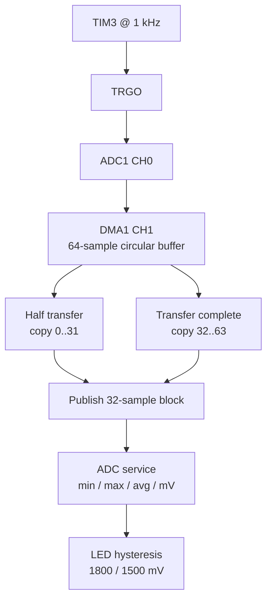

# 08 ADC DMA - Architecture

> **Focus:** ownership, dependency direction, initialization ordering, execution contexts, data lifetime, and failure invariants for `08-adc-dma`.

[← Example README](../README.md) · [Porting guide →](porting_guide.md) · [Examples index](../../README.md) · [Root](../../../README.md)

## Table of contents

- [Architectural slice](#architectural-slice)
- [Composition and initialization](#composition-and-initialization)
- [Source map and exact composition](#source-map-and-exact-composition)
- [Resource ownership](#resource-ownership)
- [Data and control flow](#data-and-control-flow)
- [Concurrency model](#concurrency-model)
- [Failure model](#failure-model)
- [Invariants](#invariants)
- [Why this structure matters](#why-this-structure-matters)
- [References](#references)

## Architectural slice

The example uses the repository's full dependency vocabulary even when some directories are intentionally thin:

```text
app
 |
 v
services
 |\
 | +------> ecual (only when an external-device protocol is used)
 v
bsp/bluepill
 |
 v
mcal
 |\
 | +------> platform/arch
 v
platform/device
```

`system` is the composition root. It initializes the concrete board resources and services before handing control to the application.

`check_layers.py` mechanically checks local include direction. `system` is intentionally exempt from normal downward-only restrictions because it is the composition root that wires otherwise separated modules together.

The architecture is **procedural and statically composed**. There is no dependency-injection framework, heap, object registry, or RTOS task container. Dependencies are expressed through C calls and, for ECUAL transports, small function-pointer interfaces.

## Composition and initialization

The reset path establishes C runtime memory before any module initialization:

```text
vector table -> Reset_Handler -> runtime_init
                              -> .data copy
                              -> .bss clear
                              -> main
```

`main()` disables global interrupts, calls `system_init()`, enables them only on success, then repeatedly executes Application and idle. This provides a strong initialization boundary: no normal IRQ should observe partially initialized service/Application state.

For this example, the exact resource behavior is summarized in its [README](../README.md). The important architectural question is the order implied by `system_init.c`: lower-level board/peripheral invariants are established before a service exposes them, and service state exists before Application starts using it.

## Source map and exact composition

### Exact composition

```text
system_init
  -> board_init
       -> RCC HSE/PLL attempt or HSI fallback
       -> board_led_init; force LED off
       -> board_adc_dma_init(PCLK2, APB1 timer clock)
            -> PA0 analog
            -> DMA1 CH1 circular buffer
            -> TIM3 TRGO generator
            -> ADC1 channel 0 + calibration
            -> NVIC DMA1_CH1 priority 1
            -> start DMA, then TIM3
  -> adc_service_init
  -> indication_service_init
  -> application_init
```

The hardware start order matters: buffer and conversion path are configured before the trigger timer is started. Once global IRQs are enabled, DMA HT/TC events can publish blocks. Thread mode then follows `application_process -> adc_service_process -> board_adc_dma_take_sample_block` before applying LED hysteresis.

## Resource ownership

A resource is considered owned by the lowest layer that must know its implementation detail:

| Concern | Owner | Reason |
|---|---|---|
| Application behavior/state | `app` | defines what the demo/product does |
| Logical capability/state | `services` | hides board/peripheral representation |
| Blue Pill pins and peripheral instance | `bsp/bluepill` | board-specific mapping |
| External IC command protocol | `ecual` when present | reusable independently of MCU bus instance |
| STM32 peripheral register sequence | `mcal` | MCU-specific but board-independent behavior |
| addresses/register structs/bit fields | `platform/device` | device register contract |
| PRIMASK/NVIC/SysTick/SCB/core ops | `platform/arch` | Cortex-M3 contract |
| startup wiring/composition/fault policy | `system` + `startup` | program construction/runtime boundary |

The key consequence is that Application can be read without RM0008 open beside it. RM0008 becomes necessary when reading MCAL/platform code, exactly where the register-level knowledge is supposed to live.

## Data and control flow



DMA owns writes to the circular acquisition buffer. The DMA ISR copies only a completed half into the BSP-owned stable block, and thread mode atomically copies that published block before analysis.

## Concurrency model

TIM3 generates ADC trigger events in hardware, DMA writes the circular buffer autonomously, and DMA1 Channel 1 interrupts publish completed halves. `board_adc_dma_take_sample_block()` saves PRIMASK while copying the stable 32-sample block and clearing `g_block_ready`, preventing ISR publication from racing that transfer. If a new half completes before the previous published block is consumed, the newer block replaces it and the overrun counter increments.

## Failure model

ADC/DMA/timer-trigger/GPIO initialization failures propagate to `system_panic()`. At runtime, DMA transfer errors increment `g_error_count`; publishing over an unconsumed block increments `g_overrun_count` and replaces the single pending block with the newest completed half. The application exposes both counters for debugger inspection while continuing to process subsequent measurements.

## Invariants

1. DMA writes only the circular acquisition buffer; service never analyzes that live memory directly.
2. ISR publishes only a half after DMA signals HT or TC completion.
3. `g_block_ready` defines single-slot ownership; publishing over an unconsumed block increments overrun before replacement.
4. Thread copy/ready-clear is atomic relative to DMA ISR publication.
5. ADC clock must remain within configured/hardware limit and trigger rate must be exactly derived from the active timer clock.
6. Application consumes processed measurements, never ADC/DMA registers or raw DMA pointers.

These invariants define the current ownership and concurrency contract. Violating one changes the runtime model and requires corresponding implementation and verification changes.

## Why this structure matters

A register-level project can easily become unmaintainable if every layer knows every bit field. This repository instead uses direct register access to make the hardware mechanism visible **and** a dependency boundary to keep that mechanism local.

That yields three practical learning benefits:

1. You can trace a high-level request down to the exact register writes.
2. You can change hardware binding without rewriting Application policy.
3. You can reason about ISR/shared-state ownership because there are few legal places where the same resource may be touched.

The cost is more source files and explicit interfaces than a single-file tutorial. That cost is deliberate: the project is practicing firmware architecture at the same time as register programming.

## References

- [STMicroelectronics — STM32F1 Series Documentation](https://www.st.com/en/microcontrollers-microprocessors/stm32f1-series/documentation.html)
- [STMicroelectronics — RM0008: STM32F101/102/103/105/107 Reference Manual](https://www.st.com/resource/en/reference_manual/cd00171190-stm32f101xx-stm32f102xx-stm32f103xx-stm32f105xx-and-stm32f107xx-advanced-armbased-32bit-mcus-stmicroelectronics.pdf)
- [STMicroelectronics — STM32F103C8 Product Page](https://www.st.com/en/microcontrollers-microprocessors/stm32f103c8.html)
- [Arm — Cortex-M3 Devices Generic User Guide](https://developer.arm.com/documentation/dui0552/latest/)
- [GNU Binutils — GNU linker documentation](https://sourceware.org/binutils/docs/ld/)
- [OpenOCD User's Guide](https://openocd.org/doc/html/)

---

[← Example README](../README.md) · [↑ Examples](../../README.md) · [Porting guide →](porting_guide.md)
