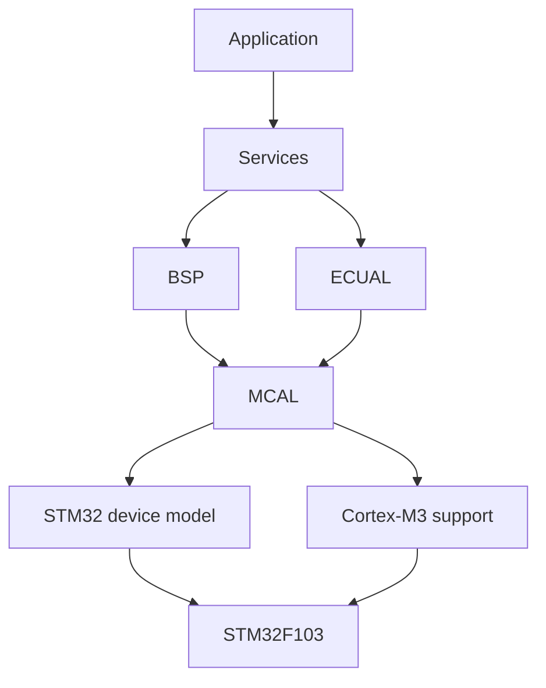
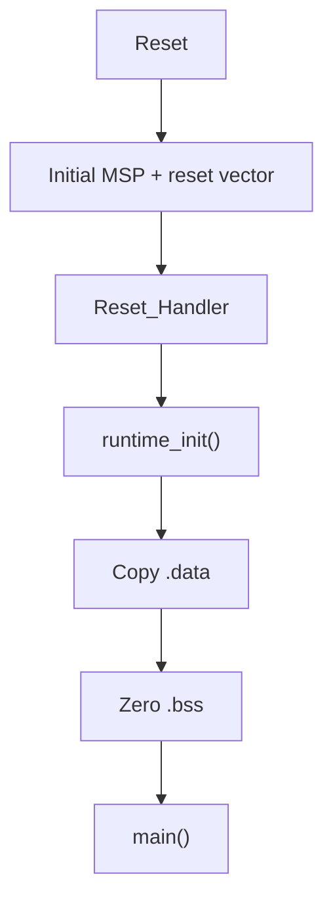
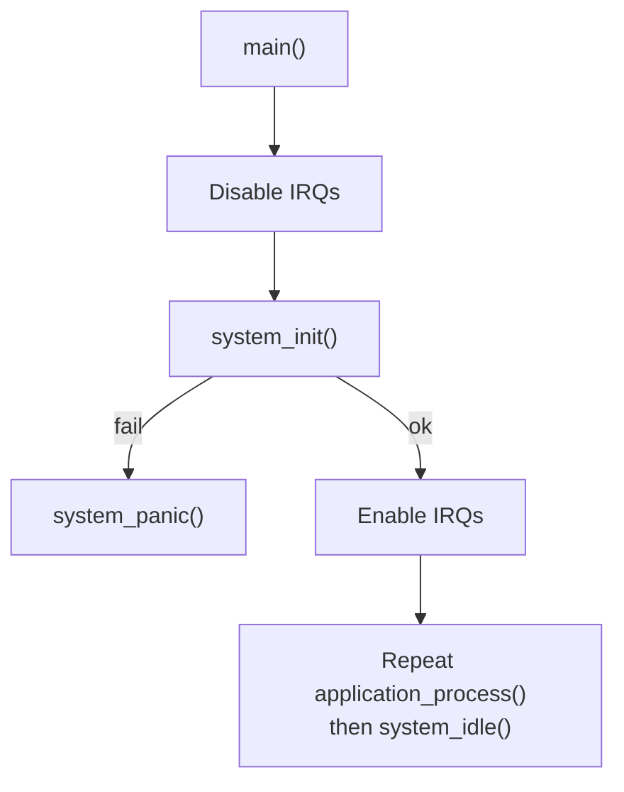

# STM32F1 Register-Level Bare-Metal

> **Scope:** a progressive STM32F103C8T6 firmware repository that implements startup, runtime, MCU peripheral access, board support, services, and application behavior without HAL, LL, SPL, Arduino, an RTOS, dynamic allocation, or vendor peripheral headers above the platform/device boundary.

[Examples](examples/README.md) · [Project template](template/README.md)

## Table of contents

- [Project purpose](#project-purpose)
- [What makes this register-level](#what-makes-this-register-level)
- [Architecture](#architecture)
- [Reset and runtime model](#reset-and-runtime-model)
- [Clock policy](#clock-policy)
- [Interrupt and concurrency policy](#interrupt-and-concurrency-policy)
- [Example roadmap](#example-roadmap)
- [Build and debug model](#build-and-debug-model)
- [Repository contracts](#repository-contracts)
- [Design decisions and limitations](#design-decisions-and-limitations)
- [References](#references)

## Project purpose

This repository is not a collection of isolated peripheral snippets. It is a deliberately repeated firmware architecture used to study how an STM32F103C8T6 works from reset to application behavior while keeping responsibilities separated enough that the low-level details remain understandable.

The examples progress from a GPIO/SysTick loop to interrupt handoff, UART buffering, hardware PWM, external I2C/SPI devices, and finally a timer-triggered ADC/DMA pipeline. Each example is independently buildable, but the important invariant is that the same dependency direction is retained while the hardware mechanism becomes more complex.

The target used by the repository is:

| Property | Project value |
|---|---|
| MCU | STM32F103C8T6 |
| Development board | Blue Pill |
| CPU | Arm Cortex-M3 |
| Linker Flash region | `0x08000000`, 64 KiB |
| Linker SRAM region | `0x20000000`, 20 KiB |
| HSE | 8 MHz |
| Preferred SYSCLK | 72 MHz |
| Fallback SYSCLK | 8 MHz HSI |
| Language | C11 + GNU assembler |
| Allocation policy | static storage only |
| Build | GNU Make + GNU Arm Embedded toolchain |
| Flash/debug | ST-Link, SWD, OpenOCD, GDB |

The repository intentionally does **not** treat 72 MHz as an unconditional fact. The RCC implementation attempts the 8 MHz HSE + PLL path, records the active clock, and falls back to HSI when the external-clock path cannot be established. Peripheral code therefore receives or queries the actual clock it needs.

## What makes this register-level

The project owns the STM32 register surface it uses. Instead of including a vendor device header and calling a library API, each example defines the required memory-map constants, register-layout structures, and bit masks under `platform/device/stm32f103xb/`.

A representative access chain is:

```text
RM0008 register description
        |
        v
platform/device/stm32f103xb
  - base addresses
  - volatile register structs
  - bit masks / IRQ numbers
        |
        v
MCAL
  - RCC/GPIO/USART/TIM/I2C/SPI/ADC/DMA behavior
        |
        v
BSP / ECUAL / Services
        |
        v
Application
```

For example, the device layer models GPIO as a C structure whose first fields correspond to `CRL`, `CRH`, `IDR`, `ODR`, `BSRR`, `BRR`, and `LCKR`, then maps `GPIOA`, `GPIOB`, and `GPIOC` to the STM32F1 APB2 addresses. The MCAL is allowed to operate on those registers; the Application is not.

This distinction matters. “Register-level” in this repository does **not** mean placing `GPIOC->BSRR = ...` throughout product logic. The point is to understand and own the register interaction while still constraining where it may occur.



`system` is the composition root: it initializes board resources, services, and the application in a controlled order without reversing the normal dependency direction.

## Architecture

The repeated project layout is architectural rather than cosmetic:

```text
app/                     product/demo policy
services/                hardware-independent capabilities
bsp/bluepill/            mapping from logical resources to Blue Pill pins/peripherals
ecual/                    external-component protocols such as SSD1306/W25Q64
mcal/                     generic STM32 peripheral drivers
platform/device/          STM32F103 register model and IRQ identities
platform/arch/cortex-m3/  core instructions and system-control register model
common/                   portable types/utilities
config/                   compile-time policy and constraints
system/                   composition root, panic/fault policy, main loop
startup/                  vector table and C runtime initialization
linker/                   memory placement and symbols consumed by startup
tools/                    layer checker, OpenOCD, GDB, flash/debug helpers
tests/                    host-test placeholder/extension point
```

### Dependency contract

`tools/scripts/check_layers.py` scans project-local includes and rejects forbidden layer dependencies. The allowed dependency graph is therefore a mechanically enforced repository contract:

| Source layer | May depend on |
|---|---|
| `app` | app, services, common, config |
| `services` | services, BSP, ECUAL, common, config |
| `ecual` | ECUAL, MCAL, common, config |
| `bsp` | BSP, MCAL, common, config |
| `mcal` | MCAL, platform, common, config |
| `platform` | platform, common, config |
| `common` | common, config |
| `config` | config, common |
| `startup` | startup, common, config |
| `system` | all project layers as the composition root |

The checker operates on include dependencies. It does not prove runtime correctness or detect every possible architectural coupling, but it prevents the most damaging form of erosion: higher layers reaching directly into MCU or board internals.

### Ownership model

A useful way to read an example is to ask “who owns the resource?” rather than “where is the function called?”

- The **Application** owns behavior: blink period, echo policy, PWM ramp, display content, memory self-test policy, LED thresholds.
- A **Service** owns a logical capability and portable state: time, indication, button semantics, serial access, display API, memory API, ADC measurements.
- The **BSP** owns physical board binding: PC13 is the status LED, PA0 is a button/ADC/PWM pin depending on the example, USART1 uses PA9/PA10, I2C1 uses PB6/PB7, and so on.
- **ECUAL** owns external-device protocol state and commands, not MCU registers.
- **MCAL** owns MCU peripheral configuration and register sequences.
- **Platform Device** owns the raw STM32F103 register vocabulary.
- **Platform Architecture** owns Cortex-M3 operations such as `CPSID`, `CPSIE`, PRIMASK, `WFI`, `DSB`, `ISB`, NVIC/SysTick/SCB register access.

## Reset and runtime model

The repository supplies its own startup assembly and linker script. There is no vendor startup file hidden beneath the examples.

**Reset-to-`main()` path**



**Initialization and steady-state runtime**



### Linker/runtime contract

`linker/stm32f103c8t6.ld` defines:

- Flash at `0x08000000`, length 64 KiB;
- SRAM at `0x20000000`, length 20 KiB;
- `_estack` at the top of SRAM;
- `.isr_vector` kept at the beginning of Flash;
- `.text` and `.rodata` in Flash;
- `.data` in SRAM with its initial image loaded from Flash;
- `.bss` and `.noinit` in SRAM;
- linker symbols `_sidata`, `_sdata`, `_edata`, `_sbss`, `_ebss` consumed by `runtime_init.c`;
- a 1 KiB `_Min_Stack_Size` safety reservation checked with a linker `ASSERT` against static RAM growth.

The stack reservation is a link-time collision guard, not a measured worst-case stack bound. It should not be interpreted as proof that 1 KiB is sufficient for every future extension.

### Vector and fault policy

The startup file defines the STM32F103 medium-density vector table and weak default handlers. Project fault handlers (`NMI`, `HardFault`, `MemManage`, `BusFault`, `UsageFault`) converge on `system_panic()`. Concrete examples deliberately panic in a debugger-friendly NOP loop with interrupts disabled.

Global interrupts remain disabled throughout `system_init()`. This is an important runtime contract: initialization code must not depend on an interrupt-driven timebase unless it explicitly enables that dependency. The I2C-display and SPI-memory examples therefore use bounded/busy initialization delays instead of assuming SysTick is already advancing.

## Clock policy

The RCC MCAL follows a defensive sequence rather than blindly enabling PLL:

1. enable and wait for HSI;
2. switch SYSCLK to HSI before reconfiguring PLL;
3. disable PLL and wait until it is no longer ready;
4. enable HSE and wait with a bounded loop;
5. program Flash prefetch/wait states for the target clock;
6. choose APB1 `/2` when SYSCLK exceeds 36 MHz;
7. configure HSE as PLL source and encode the integer multiplier;
8. enable/wait for PLL;
9. switch SYSCLK to PLL and verify the switch;
10. record the active system clock.

For the normal board configuration:

```text
HSE = 8 MHz
PLL = x9
SYSCLK = 72 MHz
APB2 = 72 MHz
APB1 = 36 MHz
APB1 timer clock = 72 MHz because APB1 prescaler != 1
```

If HSE/PLL setup fails, `mcal_rcc_use_hsi()` returns the system to an 8 MHz HSI configuration and resets prescaler/PLL-source state. Later examples query derived bus clocks so USART, I2C, SPI, timers, and ADC can be configured from the active clock rather than a compile-time fantasy.

Flash latency is chosen from the target frequency thresholds implemented in the MCAL: zero wait state up to 24 MHz, one up to 48 MHz, otherwise two; prefetch is enabled.

## Interrupt and concurrency policy

The examples intentionally grow from no peripheral IRQs to several interrupt/thread handoff patterns.

A recurring rule is:

```text
hardware interrupt
      |
      v
lowest owning ISR
  - acknowledge/clear flag
  - capture minimum data/event
  - update bounded shared state
      |
      v
thread mode
  - debounce / protocol policy / statistics / application behavior
```

The examples demonstrate several distinct ownership strategies:

| Example | Shared-state strategy |
|---|---|
| 01 | SysTick ISR increments a `volatile uint32_t` tick counter; thread reads it |
| 02 | EXTI ISR ORs an event bit; thread test-and-clears it under PRIMASK protection |
| 03 | no USART IRQ; all RX/TX polling occurs in thread mode |
| 04 | SPSC RX/TX rings split producer/consumer ownership between ISR and thread; short critical section protects TX enqueue/TXEIE race |
| 05 | SysTick only; TIM2 PWM runs autonomously in hardware |
| 06 | SysTick plus bounded, synchronous I2C transactions in thread mode |
| 07 | SysTick plus bounded, synchronous SPI/NOR operations in thread mode |
| 08 | DMA ISR publishes a stable copied half-buffer; thread consumes it under a bounded critical section |

The repository uses `volatile` where state may change outside the current flow, but it does not present `volatile` as a general synchronization primitive. Correctness also depends on single-writer ownership, atomic-width accesses on Cortex-M3, explicit PRIMASK critical sections, and the exact ordering of ISR/thread operations.

## Example roadmap

The detailed roadmap lives in [examples/README.md](examples/README.md).

| # | Example | Main mechanism | Documentation |
|---:|---|---|---|
| 01 | Blink LED | GPIO + SysTick | [README](examples/01-blink-led/README.md) · [Architecture](examples/01-blink-led/docs/architecture.md) · [Porting](examples/01-blink-led/docs/porting_guide.md) |
| 02 | GPIO input interrupt | EXTI + NVIC + debounce | [README](examples/02-gpio-input-interrupt/README.md) · [Architecture](examples/02-gpio-input-interrupt/docs/architecture.md) · [Porting](examples/02-gpio-input-interrupt/docs/porting_guide.md) |
| 03 | UART polling | USART1 TXE/RXNE polling | [README](examples/03-uart-polling/README.md) · [Architecture](examples/03-uart-polling/docs/architecture.md) · [Porting](examples/03-uart-polling/docs/porting_guide.md) |
| 04 | UART IRQ ring buffer | USART IRQ + two SPSC rings | [README](examples/04-uart-interrupt-ring-buffer/README.md) · [Architecture](examples/04-uart-interrupt-ring-buffer/docs/architecture.md) · [Porting](examples/04-uart-interrupt-ring-buffer/docs/porting_guide.md) |
| 05 | Timer PWM | TIM2 CH1 PWM1 + preload | [README](examples/05-timer-pwm/README.md) · [Architecture](examples/05-timer-pwm/docs/architecture.md) · [Porting](examples/05-timer-pwm/docs/porting_guide.md) |
| 06 | I2C display | I2C1 + SSD1306 framebuffer | [README](examples/06-i2c-display/README.md) · [Architecture](examples/06-i2c-display/docs/architecture.md) · [Porting](examples/06-i2c-display/docs/porting_guide.md) |
| 07 | SPI memory | SPI1 + W25Q64 erase/program/read | [README](examples/07-spi-memory/README.md) · [Architecture](examples/07-spi-memory/docs/architecture.md) · [Porting](examples/07-spi-memory/docs/porting_guide.md) |
| 08 | ADC DMA | TIM3 TRGO + ADC1 + DMA1 CH1 | [README](examples/08-adc-dma/README.md) · [Architecture](examples/08-adc-dma/docs/architecture.md) · [Porting](examples/08-adc-dma/docs/porting_guide.md) |

A reusable skeleton is documented under [template/README.md](template/README.md).

## Build and debug model

Each concrete example is a self-contained Make project. Typical commands from an example directory are:

```bash
make
make size
make flash
make debug-server
make debug
make clean
```

The build uses Cortex-M3 Thumb code, C11, `-ffreestanding`, `-fno-builtin`, section-level garbage collection, no standard startup files, no standard library, and links `libgcc` for compiler helper routines. The example Makefiles produce ELF, BIN, Intel HEX, disassembly/source listing, and a linker map.

The checked-in OpenOCD configuration uses ST-Link with SWD (`interface/stlink.cfg`, `target/stm32f1x.cfg`) at a 1 MHz adapter speed. The GDB script connects to OpenOCD on port 3333, resets/halts, loads the image, places a breakpoint at `main`, and continues.

### Layer check before compilation

`make` runs `check-layers` before building. This means an architectural include violation is intended to fail earlier than a compiler/linker failure.

## Repository contracts

Several project properties are worth treating as contracts when extending the repository:

1. **No dynamic allocation.** Buffers, driver state, and service state are statically allocated.
2. **No hidden startup runtime.** The vector table, data/BSS initialization, linker placement, and main entry are owned by the project.
3. **MCAL is the register-access boundary.** Board, service, and application code should not learn peripheral register bitfields.
4. **The device header is minimal.** Add only the STM32 register surface a feature actually requires instead of replacing it with a giant vendor header.
5. **Initialization is bottom-up.** `system_init()` is the composition root and performs board/lower-layer setup before application behavior begins.
6. **Failure is explicit.** Initialization paths return `bool`/status and eventually fail closed into `system_panic()` when the system cannot establish a required invariant.
7. **ISR work is bounded.** Interrupts acknowledge hardware and transfer ownership; long protocol/policy work stays in thread mode.
8. **Clock assumptions are derived.** Drivers use active bus/timer clocks.
9. **Polling loops are bounded where a peripheral can stall.** I2C/SPI/RCC/ADC calibration code includes finite wait limits.
10. **Source layering is mechanically checked.** `check_layers.py` is part of the architecture, not an optional style tool.

## Design decisions and limitations

This repository optimizes for transparency and learning rather than maximum reuse or production completeness.

- Register definitions are intentionally hand-written and feature-scoped. This exposes the memory-mapped model clearly, but adding a peripheral requires careful comparison against RM0008 and the device datasheet.
- Concrete examples use `NOP` in `system_idle()` for predictable debugger attachment with the expected ST-Link setup. The template uses `WFI`, showing the low-power alternative once wake/reset/debug behavior is intentionally designed.
- The examples use a cooperative super-loop rather than an RTOS. Timing and responsiveness therefore depend on keeping `application_process()` and synchronous transactions bounded.
- The RCC fallback improves robustness, but a system whose external oscillator is safety- or timing-critical may need to reject HSI fallback rather than continue at reduced clock.
- Static layer checking validates include direction, not every semantic dependency or concurrency property.
- The examples are intentionally small. They do not implement production concerns such as watchdog supervision, brown-out recovery policy, bootloader integration, formal timing analysis, persistent diagnostics, or fault-tolerant communication.

Those omissions are useful boundaries: the project is a register-level firmware learning stack, not a claim to be a complete production BSP or MCU SDK.

## References

- [STMicroelectronics — STM32F1 Series Documentation](https://www.st.com/en/microcontrollers-microprocessors/stm32f1-series/documentation.html)
- [STMicroelectronics — RM0008: STM32F101/102/103/105/107 Reference Manual](https://www.st.com/resource/en/reference_manual/cd00171190-stm32f101xx-stm32f102xx-stm32f103xx-stm32f105xx-and-stm32f107xx-advanced-armbased-32bit-mcus-stmicroelectronics.pdf)
- [STMicroelectronics — STM32F103C8 Product Page](https://www.st.com/en/microcontrollers-microprocessors/stm32f103c8.html)
- [Arm — Cortex-M3 Devices Generic User Guide](https://developer.arm.com/documentation/dui0552/latest/)
- [GNU Binutils — GNU linker documentation](https://sourceware.org/binutils/docs/ld/)
- [OpenOCD User's Guide](https://openocd.org/doc/html/)
