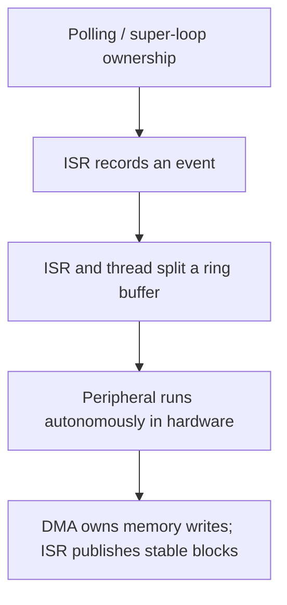

# STM32F1 Register-Level Examples

> **Purpose:** eight independently buildable projects that reuse one architecture while progressively adding STM32F103 register-level mechanisms and increasingly demanding ISR/thread ownership patterns.

[← Root README](../README.md) · [Project template](../template/README.md)

## Table of contents

- [Learning sequence](#learning-sequence)
- [What stays constant](#what-stays-constant)
- [What changes in each example](#what-changes-in-each-example)
- [Hardware and wiring summary](#hardware-and-wiring-summary)
- [Concurrency progression](#concurrency-progression)
- [How to study an example](#how-to-study-an-example)
- [Build and validation](#build-and-validation)
- [References](#references)

## Learning sequence


The numerical order is deliberate. A new example adds a concept while preserving the startup, linker, composition-root, layering, clock, and debug model already learned.

| # | Example | Primary mechanism | Main systems lesson |
|---:|---|---|---|
| 01 | [Blink LED](01-blink-led/README.md) | PC13 GPIO + SysTick | separate logical time/indication from register access |
| 02 | [GPIO input interrupt](02-gpio-input-interrupt/README.md) | PA0 + EXTI0 + NVIC | edge capture in ISR, debounce in thread mode |
| 03 | [UART polling](03-uart-polling/README.md) | USART1 TXE/RXNE | bounded non-blocking polling and hardware error handling |
| 04 | [UART IRQ ring buffer](04-uart-interrupt-ring-buffer/README.md) | USART1 IRQ + RX/TX rings | explicit SPSC ownership and interrupt-enable race handling |
| 05 | [Timer PWM](05-timer-pwm/README.md) | TIM2 CH1 | derive PSC/ARR/CCR from the real APB timer clock |
| 06 | [I2C display](06-i2c-display/README.md) | I2C1 + SSD1306 | MCU bus transport composed under an external-device driver |
| 07 | [SPI memory](07-spi-memory/README.md) | SPI1 + W25Q64 | command/status protocol, destructive erase/program semantics |
| 08 | [ADC DMA](08-adc-dma/README.md) | TIM3 TRGO + ADC1 + DMA1 CH1 | autonomous sampled-data pipeline and stable block ownership |

Each example has three documentation entry points:

```text
README.md              behavior, wiring, configuration, mechanism, debug
  |
  +-- docs/architecture.md   ownership, dataflow, concurrency, invariants
  |
  +-- docs/porting_guide.md  what must change when board/clock/peripheral changes
```

## What stays constant

### Startup and linker

Every example owns the vector table and reset path. `Reset_Handler` calls `runtime_init()`, which copies `.data`, clears `.bss`, calls `main()`, and traps if `main()` unexpectedly returns. The linker fixes Flash/SRAM regions to the STM32F103C8T6 target and checks that static sections leave the configured stack reserve.

### Main-loop contract

Concrete examples use the same top-level structure:

```text
disable IRQ
    |
system_init()
    |
    +-- fail -> panic forever
    |
enable IRQ
    |
forever:
    application_process()
    system_idle()  // NOP in the completed examples
```

Because interrupts are enabled **after** initialization, code run inside `board_init()`, service initialization, ECUAL initialization, and `application_init()` cannot silently assume an interrupt timebase is alive.

### Clock contract

All examples attempt 72 MHz from 8 MHz HSE and fall back to 8 MHz HSI. Later drivers receive the active clock instead of using hard-coded divisors. This is especially visible when studying:

- USART1 BRR in examples 03/04;
- TIM2 PWM in example 05;
- I2C1 CCR/TRISE in example 06;
- SPI1 baud prescaler in example 07;
- TIM3 and ADC prescalers in example 08.

### Register boundary

The repeated architecture is:

```text
Application
    |
Services
   / \
 BSP ECUAL
   \ /
   MCAL
    |
Platform device + Cortex-M3 arch
    |
Hardware
```

The layer checker enforces source include direction. This makes it possible to study raw registers without allowing those raw registers to contaminate every layer.

## What changes in each example

### 01 - GPIO output and timebase

PC13 is treated as a logical status indication even though the Blue Pill LED is active-low. SysTick owns a 1 ms tick. Application requests a toggle every 500 ms using a non-blocking elapsed-time check. A static event queue exists as an educational scaffold but is not part of the actual blink data path.

### 02 - EXTI event capture and debounce

PA0 is configured with an internal pull-up and a falling-edge EXTI0 interrupt at project priority 2. The ISR clears the EXTI pending bit and latches an event. Thread mode atomically takes the event, starts a 30 ms debounce window, and later samples the physical pin. This intentionally separates “an electrical edge happened” from “a stable button press was accepted.”

### 03 - USART polling

USART1 runs on PA9/PA10 at 115200 8N1. The application first streams a greeting one byte at a time whenever TXE permits, then performs an echo loop. The MCAL handles RXNE and error flags by reading SR/DR in the required sequence. There is no software RX queue; the example therefore exposes the throughput limitation of polling directly.

### 04 - USART interrupt rings

The same UART becomes interrupt-driven. RX and TX each use a 128-byte power-of-two ring with one slot reserved to distinguish full from empty, so usable capacity is 127 bytes. RX is ISR-producer/thread-consumer; TX is thread-producer/ISR-consumer. A short PRIMASK critical section protects enqueue plus TXEIE enable from the classic empty-queue interrupt-disable race.

### 05 - Hardware PWM

TIM2 CH1 drives PA0. The MCAL derives a 1 MHz timer tick and 1 kHz PWM period from the actual APB1 timer clock. With the normal 72 MHz timer clock, PSC=71 and ARR=999. CCR1 is expressed in permille, allowing 0% and 100% endpoints. Application ramps duty by 10 permille every 10 ms while hardware produces the waveform autonomously.

### 06 - External display over I2C

I2C1 uses PB6/PB7 at a requested 400 kHz. An ECUAL SSD1306 driver owns a 1024-byte framebuffer and the controller command sequence; the BSP supplies the I2C transport. The application renders uptime and a moving progress value every 100 ms. Runtime display-transfer failure marks the display non-operational and stops further updates rather than retrying indefinitely.

### 07 - External NOR flash over SPI

SPI1 uses PA4..PA7, with software chip select and a requested ceiling of 5 MHz. The W25Q64 ECUAL validates Winbond manufacturer `0xEF` and capacity code `0x17`, then exposes bounded read/sector-erase/page-program operations. The application deliberately erases the final 4 KiB sector (`0x007FF000`), writes a 32-byte test pattern, reads it back, and performs byte-for-byte verification on every reset.

### 08 - Autonomous ADC/DMA pipeline

TIM3 update events trigger ADC1 channel 0 at 1 kHz. DMA1 Channel 1 fills a 64-sample circular buffer and signals half/full events. The BSP copies the completed 32-sample half in the ISR into stable storage. If thread mode has not consumed the prior block, an overrun counter is incremented and the newer block replaces it: the explicit policy is latest-block-wins. The service computes min/max/rounded average/millivolts, and Application applies 1800/1500 mV hysteresis to PC13.

## Hardware and wiring summary

### SWD used by all examples

```text
ST-Link             Blue Pill
--------------------------------
SWDIO      ------>  PA13 / SWDIO
SWCLK      ------>  PA14 / SWCLK
GND        -------  GND
3.3 V ref  -------  3.3 V
```

The expected signal level is 3.3 V.

### Per-example external connections

| Example | Connection |
|---|---|
| 01 | onboard PC13 LED |
| 02 | PA0 button to GND; internal pull-up enabled |
| 03/04 | PA9 TX -> USB-UART RX, PA10 RX <- USB-UART TX, common GND |
| 05 | PA0/TIM2_CH1 -> load/LED through suitable resistor or logic analyzer |
| 06 | PB6 SCL, PB7 SDA -> 3.3 V SSD1306 I2C module |
| 07 | PA4 CS, PA5 SCK, PA6 MISO, PA7 MOSI -> 3.3 V W25Q64 |
| 08 | potentiometer wiper -> PA0/ADC1_IN0, ends -> 3.3 V and GND |

Always check the actual module board. Some display or flash breakout boards include level shifting/pull-ups/regulators and some do not.

## Concurrency progression

The examples are especially useful when read as a progression in ownership rather than only peripheral count:



- **01:** SysTick changes one counter asynchronously.
- **02:** EXTI produces event bits and thread mode consumes them atomically.
- **03:** UART is completely thread-polled.
- **04:** two SPSC queues establish independent byte-stream ownership across execution contexts.
- **05:** TIM2 waveform generation no longer needs CPU intervention per edge.
- **06/07:** synchronous bus operations are bounded but can occupy the cooperative loop for meaningful time.
- **08:** timer, ADC, and DMA form a hardware pipeline; CPU work is block-level rather than sample-level.

This progression is the core learning value of the series.

## How to study an example

A useful reading order is:

1. `config/*.h` — identify policy values and compile-time guards.
2. `system/system_init.c` — reconstruct initialization order and failure propagation.
3. `bsp/bluepill/` — see physical pin/peripheral ownership.
4. `services/` and `ecual/` — identify the portable API and state model.
5. `mcal/` — follow register programming and timeout/IRQ behavior.
6. `platform/device/` — verify register offsets/bit masks against RM0008.
7. `app/src/application.c` — see what hardware details the application no longer needs to know.
8. `docs/architecture.md` — inspect concurrency/invariants after reading the implementation.
9. `docs/porting_guide.md` — test whether you understand which assumptions are board-, MCU-, or application-specific.

## Build and validation

From an example directory:

```bash
make check-layers
make
make size
make flash
```

For debug:

```bash
make debug-server
# second terminal
make debug
```

`check_layers.py` is intentionally run before compilation by `make`. It should remain green when modifying an example. Compilation, Flash verification, and on-target behavior are separate validation layers; a passing source-layer check does not imply peripheral wiring or timing is correct.

## References

- [STMicroelectronics — STM32F1 Series Documentation](https://www.st.com/en/microcontrollers-microprocessors/stm32f1-series/documentation.html)
- [STMicroelectronics — RM0008: STM32F101/102/103/105/107 Reference Manual](https://www.st.com/resource/en/reference_manual/cd00171190-stm32f101xx-stm32f102xx-stm32f103xx-stm32f105xx-and-stm32f107xx-advanced-armbased-32bit-mcus-stmicroelectronics.pdf)
- [STMicroelectronics — STM32F103C8 Product Page](https://www.st.com/en/microcontrollers-microprocessors/stm32f103c8.html)
- [Arm — Cortex-M3 Devices Generic User Guide](https://developer.arm.com/documentation/dui0552/latest/)
- [GNU Binutils — GNU linker documentation](https://sourceware.org/binutils/docs/ld/)
- [OpenOCD User's Guide](https://openocd.org/doc/html/)

---

[← Root README](../README.md) · [01 Blink LED →](01-blink-led/README.md)
