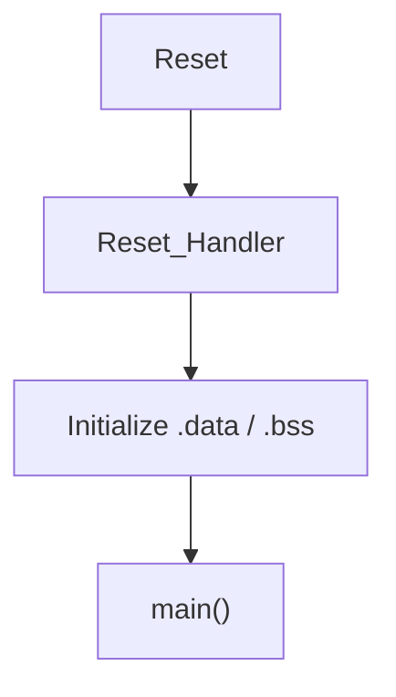
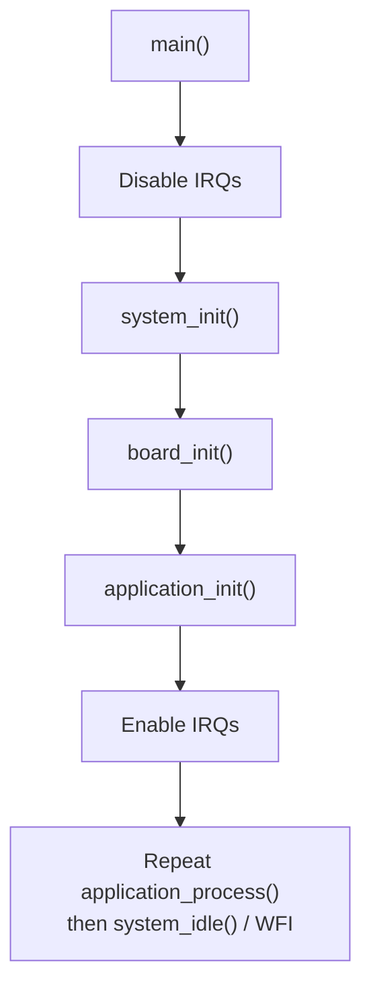
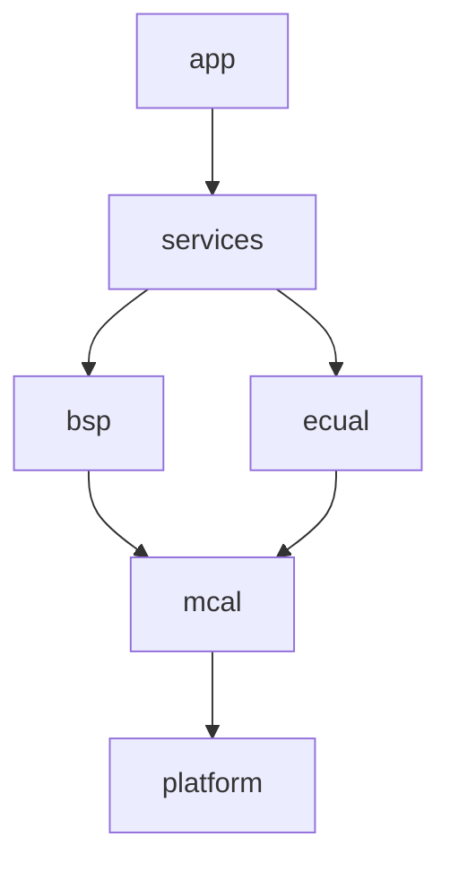

# STM32F1 Register-Level Bare-Metal Project Template

> **Scope:** a deliberately minimal starting point that preserves the repository's startup, linker, layering, composition-root, debug, and build contracts while leaving product/peripheral modules empty for a new register-level project.

[← Root README](../README.md) · [Examples](../examples/README.md) · [Architecture](docs/architecture.md) · [Adding a module](docs/adding_a_module.md) · [Porting](docs/porting_guide.md)

## Table of contents

- [What the template already owns](#what-the-template-already-owns)
- [What is intentionally empty](#what-is-intentionally-empty)
- [Runtime and composition](#runtime-and-composition)
- [Layer contract](#layer-contract)
- [Build and debug](#build-and-debug)
- [How to start a new project](#how-to-start-a-new-project)
- [Design rules](#design-rules)
- [References](#references)

## What the template already owns

The template is not an empty directory tree. It already provides the infrastructure that every example repeats:

- STM32F103C8T6 linker memory regions: 64 KiB Flash, 20 KiB SRAM;
- vector table and weak exception handlers;
- `Reset_Handler -> runtime_init()` path;
- `.data` copy and `.bss` zeroing;
- system composition root and fault/panic policy;
- Cortex-M3 architecture helpers for IRQ control, PRIMASK, WFI, barriers, reset, and NOP;
- hand-owned build system with freestanding Cortex-M3 flags;
- OpenOCD ST-Link/SWD configuration;
- GDB launch script;
- static include-layer checker.

This allows a new project to begin by adding only the device/peripheral surface it actually needs.

## What is intentionally empty

The skeleton deliberately contains no prebuilt GPIO/UART/timer driver. Current implementation state is:

```text
application_init()       -> no product initialization yet
application_process()    -> no product behavior yet
board_init()             -> returns true, no board peripherals configured
services/                -> placeholders only
ecual/                   -> placeholders only
mcal/                    -> placeholders only
platform/device/         -> add the device register surface required by the project
```

`config/project_config.h` is also intentionally empty except for its include guard and comment.

The template therefore teaches an important rule: **copy architecture, not unused drivers**. A new feature should bring in the minimum register model and modules it needs, with explicit ownership.

## Runtime and composition

**Reset and C runtime**



**System construction and steady state**



The template differs intentionally from the completed examples in one visible way: `system_idle()` uses `cortex_m3_wait_for_interrupt()` rather than NOP. This demonstrates the normal low-power idle shape, but a concrete project must ensure it has a wake source and that its debugger/reset strategy works with WFI before retaining it.

`system_panic()` disables interrupts and also waits in a WFI loop. If a new project needs debugger-always-responsive panic behavior, watchdog recovery, fault logging, or a hardware safe-state, that policy belongs in `system/system_control.c` rather than being scattered through drivers.

## Layer contract

The template's `check_layers.py` enforces the same dependency rules as the examples:



`system` composes these layers at startup. `common` and `config` provide shared types, utilities, and compile-time policy rather than forming another runtime layer.

The practical rule for register-level work is simple:

> Add raw STM32 addresses, register layouts, and field encodings at the platform/device boundary; consume them from MCAL; do not leak them upward because it is convenient.

[Architecture](docs/architecture.md) explains this contract in more detail.

## Build and debug

The template Makefile uses:

```text
-mcpu=cortex-m3 -mthumb
-std=c11 -Og -g3
-ffreestanding -fno-builtin
-ffunction-sections -fdata-sections
-Wall -Wextra -Wpedantic -Wshadow -Wconversion -Wundef
-nostartfiles -nostdlib
-Tlinker/stm32f103c8t6.ld
-Wl,--gc-sections
-lgcc
```

Assembler input also uses `--noexecstack`. Outputs are ELF, BIN, HEX, LST, map, and size information.

Commands:

```bash
make check-layers
make
make size
make flash
make debug-server
make debug
make clean
```

GDB selection prefers `arm-none-eabi-gdb` and falls back to `gdb-multiarch` when available. `make debug` includes an explicit debugger-availability check.

## How to start a new project

1. Copy `template/` to a new project directory.
2. Define project-wide configuration values in `config/` rather than hard-coding policy in MCAL.
3. Write down the hardware resource map: pins, peripheral instances, clocks, IRQs, DMA channels.
4. Add only the necessary device register definitions under `platform/device/`.
5. Implement the MCU peripheral behavior in MCAL.
6. Bind physical board resources in BSP.
7. If an external IC is involved, keep its protocol in ECUAL and inject a BSP/MCAL transport.
8. Add a service when Application should use a logical capability instead of a board/peripheral API.
9. Compose modules in `system_init()` in dependency order.
10. Implement non-blocking Application policy/state machines.
11. Run the layer checker before bringing up hardware.
12. Validate with debugger and instruments from clock/pin/register state upward.

See [Adding a Module](docs/adding_a_module.md) for the detailed workflow.

## Design rules

- Keep the platform/device header **minimal and verified** against the reference manual.
- Avoid unexplained numeric register literals in MCAL; use named masks/encodings.
- Keep board pin/peripheral identity out of Application.
- Do not allocate memory dynamically for driver queues/buffers in this repository style.
- Decide ISR/thread ownership before writing an interrupt handler.
- Bound status polling that can otherwise stall forever.
- Make the active clock an input to timing-sensitive driver setup.
- Preserve previous PRIMASK state in nested helper critical sections.
- Treat `system_init()` as construction: no normal Application work before it succeeds.
- Prefer explicit failure over silently continuing with a half-initialized capability.
- Re-run `check_layers.py` whenever dependencies change.

## References

- [STMicroelectronics — STM32F1 Series Documentation](https://www.st.com/en/microcontrollers-microprocessors/stm32f1-series/documentation.html)
- [STMicroelectronics — RM0008: STM32F101/102/103/105/107 Reference Manual](https://www.st.com/resource/en/reference_manual/cd00171190-stm32f101xx-stm32f102xx-stm32f103xx-stm32f105xx-and-stm32f107xx-advanced-armbased-32bit-mcus-stmicroelectronics.pdf)
- [STMicroelectronics — STM32F103C8 Product Page](https://www.st.com/en/microcontrollers-microprocessors/stm32f103c8.html)
- [Arm — Cortex-M3 Devices Generic User Guide](https://developer.arm.com/documentation/dui0552/latest/)
- [GNU Binutils — GNU linker documentation](https://sourceware.org/binutils/docs/ld/)
- [OpenOCD User's Guide](https://openocd.org/doc/html/)

---

[← Examples](../examples/README.md) · [Architecture →](docs/architecture.md)
