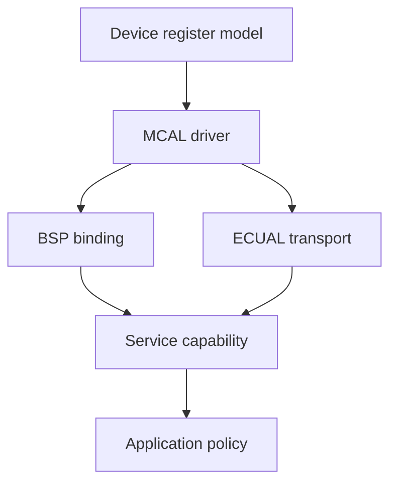

# Project Template - Adding a Module

> **Purpose:** a register-first but architecture-safe workflow for adding a new STM32 peripheral, board capability, service, or external component to the template.

[← Architecture](architecture.md) · [Template README](../README.md) · [Porting →](porting_guide.md)

## Table of contents

- [Start from ownership](#start-from-ownership)
- [Step 1 - write the hardware contract](#step-1---write-the-hardware-contract)
- [Step 2 - extend the device model](#step-2---extend-the-device-model)
- [Step 3 - implement MCAL](#step-3---implement-mcal)
- [Step 4 - bind the board](#step-4---bind-the-board)
- [Step 5 - add ECUAL or Service when justified](#step-5---add-ecual-or-service-when-justified)
- [Step 6 - compose and expose Application policy](#step-6---compose-and-expose-application-policy)
- [Interrupt and DMA design](#interrupt-and-dma-design)
- [Validation](#validation)
- [References](#references)

## Start from ownership

Before writing a line of driver code, decide what you are adding:

| Need | Correct home |
|---|---|
| new product behavior | `app` |
| portable logical capability | `services` |
| physical Blue Pill mapping | `bsp/bluepill` |
| protocol for an external IC | `ecual` |
| STM32 peripheral mechanism | `mcal` |
| missing register/IRQ definition | `platform/device` |
| CPU/exception primitive | `platform/arch` |
| cross-layer construction | `system` |

This prevents the common register-level anti-pattern where a feature starts in `application.c` with direct RCC/GPIO/peripheral writes and becomes impossible to separate later.

## Step 1 - write the hardware contract

Open the STM32F103 datasheet and RM0008 and record:

```text
peripheral instance
clock enable/reset bit
bus clock source and maximum
base address
required registers and reset states
pin(s), alternate-function/remap rules
event/flag clear semantics
IRQ number and priority requirements
DMA request/channel mapping if applicable
startup/calibration timing
error flags and timeout cases
```

If an external device is involved, do the same from its datasheet: electrical requirements, bus mode/address, startup delay, command framing, state/status model, maximum clock, and destructive operations.

This written contract becomes the basis for the module API, implementation, and validation criteria.

## Step 2 - extend the device model

Add the minimum device facts required by the driver.

### Base address

Put the address in the device memory-map header, derived from the correct APB/AHB base and offset.

### Register layout

Create or extend a `volatile` structure in register order. Preserve reserved gaps explicitly when needed so later fields remain at the documented offsets. Treat read-only fields as `volatile const` if the code should not write them.

### Bit fields

Define named masks/encodings in the register-bits header. Prefer:

```c
#define STM32_FOO_CR_ENABLE (UINT32_C(1) << 0U)
```

over repeating a magic `0x1` in multiple driver functions.

### IRQ identity

Add the vector/IRQ number only if the feature needs it and verify it against the device vector table.

## Step 3 - implement MCAL

MCAL should expose behavior, not register aliases. A good API answers questions such as:

```text
configure GPIO mode
initialize UART at baud using supplied PCLK
start timer trigger at requested rate
try to transfer a byte with bounded polling
take and clear IRQ events
```

It should validate inputs before touching hardware and return status when requested settings cannot be represented.

For timing-sensitive peripherals, pass/query the actual clock. Do not bake the normal 72 MHz clock into PSC/BRR/CCR constants.

For hardware waits, decide whether the operation:

- must be non-blocking;
- can use bounded polling;
- requires an interrupt/event handoff;
- requires DMA;
- requires a wall-clock timeout rather than iteration limit.

Make that choice explicit in the API contract and validation behavior.

## Step 4 - bind the board

BSP answers “which concrete resource implements this capability on this board?” Examples from the repository include:

```text
status LED -> PC13 active-low
button -> PA0 active-low / EXTI0
serial -> USART1 on PA9/PA10
OLED bus -> I2C1 PB6/PB7
flash bus -> SPI1 PA4..PA7
ADC input -> PA0 ADC1_IN0
```

Board code should configure pins and instantiate the MCAL capability without leaking these identities upward.

## Step 5 - add ECUAL or Service when justified

### ECUAL

Use ECUAL when the new module speaks to a distinct external component whose protocol can be independent of the MCU transport. Inject a small transport interface rather than including STM32 bus headers inside the device driver.

### Service

Use a Service when Application should see a logical capability instead of a board/peripheral API. A service may own filtering, semantic events, statistics, or logical state, but should not become a dumping ground for register details.

Not every MCAL requires both layers. The smallest correct architecture is preferable.

## Step 6 - compose and expose Application policy

Add modules to `system_init()` in dependency order. Then implement Application through Service APIs.



`system_init()` constructs the concrete BSP and service dependencies before `application_init()` runs.

If Application must know a register bit to use the feature, the abstraction boundary is not finished.

## Interrupt and DMA design

For an interrupt-driven module, write the ownership table before coding:

| State | Producer | Consumer | Protection |
|---|---|---|---|
| event bit | ISR | thread | atomic take under PRIMASK |
| RX ring head | ISR | thread reads | SPSC ownership |
| RX ring tail | thread | ISR reads | SPSC ownership |
| DMA half-buffer | DMA | ISR copies after completion | hardware event boundary |
| published block | ISR | thread | ready flag + critical copy |

Choose overflow semantics deliberately: drop newest, drop oldest, coalesce, count, block producer, or fail. “It probably won't overflow” is not a policy.

Keep ISR work bounded and never call Application directly from an interrupt in this repository architecture.

## Validation

Run layers first:

```bash
python3 tools/scripts/check_layers.py
```

Then compile/link and inspect:

```bash
make
make size
```

Use the map file to confirm section/RAM growth and the listing to inspect critical register sequences. Bring up hardware from the bottom:

```text
clock -> GPIO -> peripheral reset/enable -> static configuration
      -> status flags -> single primitive -> service -> application behavior
```

For IRQ/DMA features, test error/full/timeout/overrun paths, not only the happy path.

## References

- [STMicroelectronics — STM32F1 Series Documentation](https://www.st.com/en/microcontrollers-microprocessors/stm32f1-series/documentation.html)
- [STMicroelectronics — RM0008: STM32F101/102/103/105/107 Reference Manual](https://www.st.com/resource/en/reference_manual/cd00171190-stm32f101xx-stm32f102xx-stm32f103xx-stm32f105xx-and-stm32f107xx-advanced-armbased-32bit-mcus-stmicroelectronics.pdf)
- [STMicroelectronics — STM32F103C8 Product Page](https://www.st.com/en/microcontrollers-microprocessors/stm32f103c8.html)
- [Arm — Cortex-M3 Devices Generic User Guide](https://developer.arm.com/documentation/dui0552/latest/)
- [GNU Binutils — GNU linker documentation](https://sourceware.org/binutils/docs/ld/)
- [OpenOCD User's Guide](https://openocd.org/doc/html/)

---

[← Architecture](architecture.md) · [↑ Template README](../README.md) · [Porting →](porting_guide.md)
