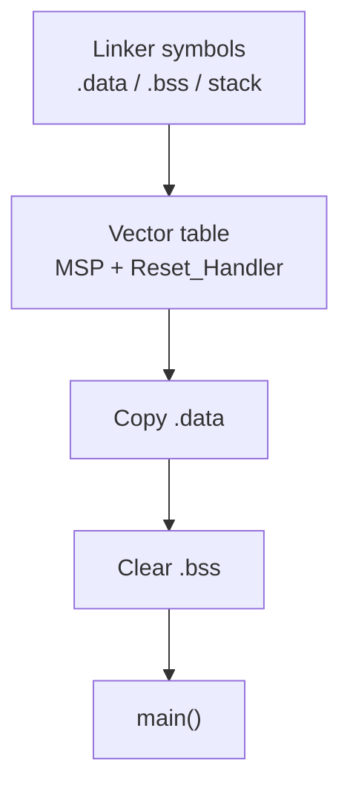

# Project Template - Architecture

> **Focus:** the structural contracts that a new register-level project inherits before any peripheral driver is added.

[← Template README](../README.md) · [Adding a module →](adding_a_module.md) · [Porting](porting_guide.md) · [Root](../../README.md)

## Table of contents

- [Architecture objective](#architecture-objective)
- [Reset and memory contract](#reset-and-memory-contract)
- [Dependency graph](#dependency-graph)
- [Composition root](#composition-root)
- [Platform split](#platform-split)
- [Interrupt ownership](#interrupt-ownership)
- [Failure and idle policy](#failure-and-idle-policy)
- [Architecture review checklist](#architecture-review-checklist)
- [References](#references)

## Architecture objective

The template separates **hardware knowledge** from **product policy** without hiding how the hardware works. This is the central design constraint of the whole repository.

```text
Product decision: "send a byte" / "show status" / "sample sensor"
        |
        v
Service API
        |
        v
Board/external-device binding
        |
        v
MCU register sequence
        |
        v
Memory-mapped peripheral
```

The intent is not to imitate a large framework. It is to keep each register sequence in a place where its assumptions can be reviewed against the reference manual.

## Reset and memory contract

The linker and startup code form one inseparable contract:



Changing memory geometry without updating the linker changes `_estack`, section placement, and the static-stack collision assertion. Replacing startup without understanding those linker symbols can leave initialized/static C objects invalid before `main()` even begins.

The template reserves 1 KiB as `_Min_Stack_Size` for link-time collision detection. This is not dynamic stack measurement or proof of worst-case interrupt nesting.

## Dependency graph

The checker encodes allowed include edges. The most important rules are:

- Application may not include BSP/MCAL/platform directly.
- Services may depend on BSP/ECUAL but not raw platform.
- BSP and ECUAL may use MCAL.
- MCAL may use platform.
- platform has no upward dependency.
- system is allowed to see all layers because it composes them.

This creates a one-way technical-debt barrier. If a new module cannot be placed without violating the graph, first ask whether its responsibility is incorrectly defined.

## Composition root

`system/system_init.c` is where concrete dependencies meet. In the untouched template it initializes `board_init()` and then Application. A real project grows this sequence explicitly:

```text
board / MCAL-backed resources
        -> services / ECUAL
        -> application
```

Avoid allowing services to initialize unrelated global modules behind the scenes. Explicit composition makes failure order and dependencies reviewable.

## Platform split

There are two different meanings of “platform”:

### `platform/arch/cortex-m3`

Owns CPU/exception architecture details:

- CPSIE/CPSID;
- PRIMASK save/restore model;
- WFI/NOP/barriers;
- SysTick/NVIC/SCB core register mappings;
- system-reset request through AIRCR.

### `platform/device/stm32f103xb`

Should own device-specific peripheral facts:

- peripheral base addresses;
- register-layout structures;
- bit masks and encoded values;
- IRQ numbers/identities.

MCAL sits above both. This split makes “move to another STM32F1 device” a different problem from “move to a non-Cortex-M CPU,” which is exactly the distinction a porting guide should expose.

## Interrupt ownership

Before enabling an IRQ, document:

1. which module owns the vector;
2. which flags must be acknowledged and how;
3. what minimum state must be copied/latching in ISR;
4. who consumes that state in thread mode;
5. whether multiple events may be coalesced or must be counted/queued;
6. what operation is atomic and what needs a critical section;
7. maximum bounded ISR work;
8. failure/overflow semantics.

Do not use `volatile` as a substitute for this ownership design.

## Failure and idle policy

The template's initialization result is a boolean. Required-resource failure should propagate to `system_init()` and then panic. A future project may add a richer error taxonomy, but it should preserve the property that Application does not begin with a silently invalid required resource.

The template idles with `WFI`. A completed example may choose NOP for debug reasons. Neither is universally correct: WFI requires a valid wake model, while NOP spends power. The decision belongs in system policy.

## Architecture review checklist

- Can Application compile without any STM32 register header?
- Does every physical pin/peripheral instance have one board owner?
- Are external-device protocols independent of a specific MCU bus driver?
- Are device register definitions limited to what the project uses?
- Can every IRQ shared variable name its producer and consumer?
- Do critical sections restore prior interrupt state?
- Is initialization order explicit and lower-to-higher?
- Are polling loops bounded when hardware may never respond?
- Is timing derived from the active clock?
- Does `check_layers.py` still pass?

## References

- [STMicroelectronics — STM32F1 Series Documentation](https://www.st.com/en/microcontrollers-microprocessors/stm32f1-series/documentation.html)
- [STMicroelectronics — RM0008: STM32F101/102/103/105/107 Reference Manual](https://www.st.com/resource/en/reference_manual/cd00171190-stm32f101xx-stm32f102xx-stm32f103xx-stm32f105xx-and-stm32f107xx-advanced-armbased-32bit-mcus-stmicroelectronics.pdf)
- [STMicroelectronics — STM32F103C8 Product Page](https://www.st.com/en/microcontrollers-microprocessors/stm32f103c8.html)
- [Arm — Cortex-M3 Devices Generic User Guide](https://developer.arm.com/documentation/dui0552/latest/)
- [GNU Binutils — GNU linker documentation](https://sourceware.org/binutils/docs/ld/)
- [OpenOCD User's Guide](https://openocd.org/doc/html/)

---

[← Template README](../README.md) · [Adding a module →](adding_a_module.md)
