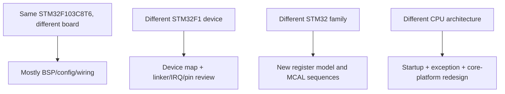

# Project Template - Porting Guide

> **Purpose:** separate board, STM32 device, and Cortex-M3 assumptions before reusing the template on different hardware.

[← Adding a module](adding_a_module.md) · [Template README](../README.md) · [Architecture](architecture.md)

## Table of contents

- [Porting levels](#porting-levels)
- [Same MCU different board](#same-mcu-different-board)
- [Different STM32F1 device](#different-stm32f1-device)
- [Different STM32 family](#different-stm32-family)
- [Different CPU architecture](#different-cpu-architecture)
- [Startup and linker review](#startup-and-linker-review)
- [Validation matrix](#validation-matrix)
- [References](#references)

## Porting levels



The larger the move, the less appropriate it is to preserve code merely because names look similar.

## Same MCU different board

Keep startup/linker/device/MCAL where the hardware truly matches, but change/re-verify:

- HSE source/frequency and whether a fallback is acceptable;
- LED/button/peripheral pin mapping and polarity;
- alternate-function remaps;
- external pull-ups/level shifting/transceivers;
- external-device address/CS wiring;
- debug connector/reset wiring;
- supply/reference assumptions such as VDDA.

This should mostly be a BSP/configuration exercise. If Application changes because the LED moved, the board abstraction has leaked.

## Different STM32F1 device

Review:

- Flash/SRAM size and linker regions;
- vector table for the exact density/device;
- peripheral availability and base addresses;
- IRQ numbers;
- DMA channel mappings;
- GPIO/remap differences;
- maximum clocks;
- package pinout;
- device errata.

Prefer a new `platform/device/<part>` directory when the register/device contract differs meaningfully.

## Different STM32 family

A move from F1 to another STM32 generation is **not** only a base-address edit. GPIO configuration style, RCC tree, Flash wait-state programming, DMA, ADC calibration/trigger selection, interrupt flags, and peripheral register layouts may differ substantially. Keep Application/Service/ECUAL interfaces when useful, but expect new platform/device and MCAL implementations.

## Different CPU architecture

Moving away from Cortex-M3 requires review of:

- reset/vector model;
- exception entry/return;
- interrupt mask primitive replacing PRIMASK semantics;
- system-control/NVIC/SysTick equivalents;
- barriers and low-power instructions;
- atomic access widths/alignment;
- linker/startup ABI assumptions.

At that point `platform/arch/cortex-m3` should be replaced, not renamed while retaining Cortex-M behavior.

## Startup and linker review

The template's startup assumes linker symbols and a conventional C runtime initialization:

```text
_sidata -> Flash load image for .data
_sdata.._edata -> SRAM .data destination
_sbss.._ebss -> zero-initialized region
_estack -> initial MSP
```

Any memory-map change must keep startup and linker consistent. Also review the 1 KiB static stack-reserve assertion; it is a project choice, not a property of the MCU.

## Validation matrix

| Validation | Board port | New F1 device | New family | New CPU arch |
|---|:---:|:---:|:---:|:---:|
| layer checker | required | required | required | required |
| linker map/section placement | verify | rewrite/verify | rewrite/verify | rewrite/verify |
| vector table | verify | verify/rewrite | rewrite | rewrite |
| clock tree | verify | verify | rewrite | rewrite |
| GPIO/peripheral MCAL | verify | verify | rewrite | rewrite |
| Cortex-M3 arch layer | same | usually same | depends | replace |
| ISR atomicity assumptions | verify | verify | verify | redesign as needed |
| instrumented peripheral bring-up | required | required | required | required |

Porting is complete only when behavior, timing, error paths, and ownership remain valid—not when the source merely compiles.

## References

- [STMicroelectronics — STM32F1 Series Documentation](https://www.st.com/en/microcontrollers-microprocessors/stm32f1-series/documentation.html)
- [STMicroelectronics — RM0008: STM32F101/102/103/105/107 Reference Manual](https://www.st.com/resource/en/reference_manual/cd00171190-stm32f101xx-stm32f102xx-stm32f103xx-stm32f105xx-and-stm32f107xx-advanced-armbased-32bit-mcus-stmicroelectronics.pdf)
- [STMicroelectronics — STM32F103C8 Product Page](https://www.st.com/en/microcontrollers-microprocessors/stm32f103c8.html)
- [Arm — Cortex-M3 Devices Generic User Guide](https://developer.arm.com/documentation/dui0552/latest/)
- [GNU Binutils — GNU linker documentation](https://sourceware.org/binutils/docs/ld/)
- [OpenOCD User's Guide](https://openocd.org/doc/html/)

---

[← Adding a module](adding_a_module.md) · [↑ Template README](../README.md) · [Root](../../README.md)
